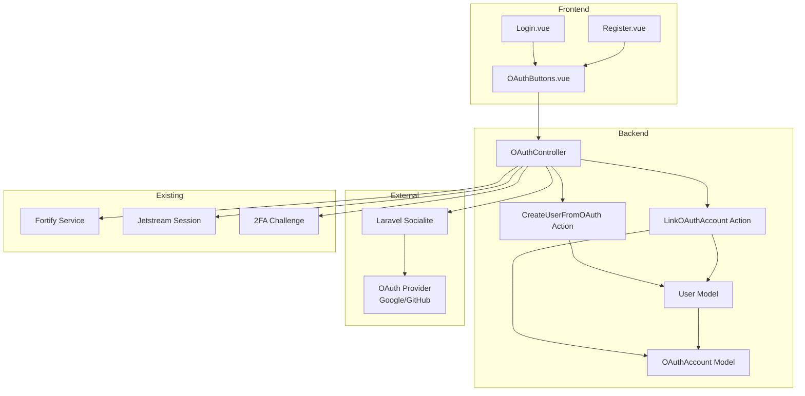
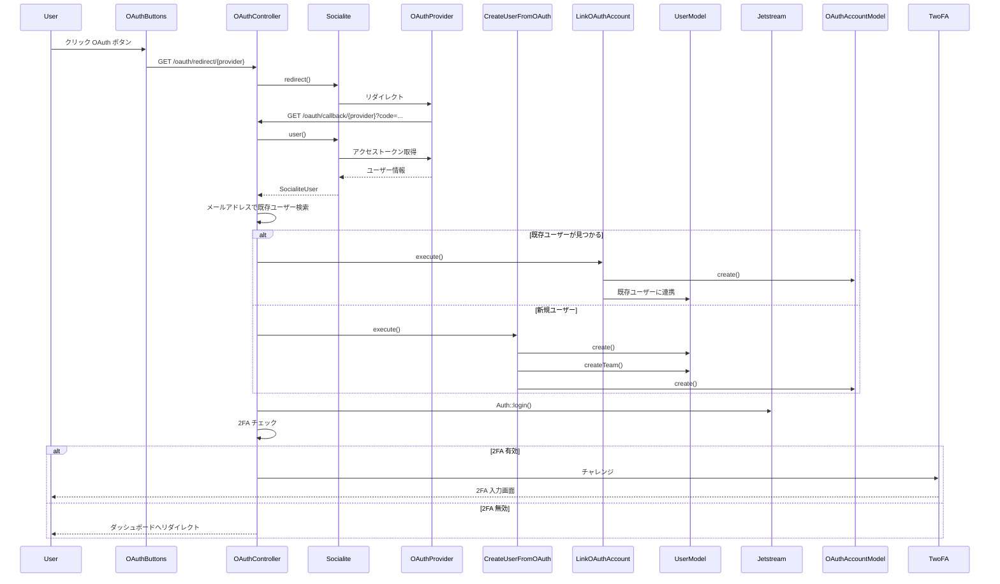

# Design Document

## Overview

本機能は、既存の Laravel Jetstream + Fortify によるメール/パスワード認証システムに、OAuth ソーシャルログイン機能を追加する。ユーザーは Google、GitHub などの OAuth プロバイダーを使用してログイン・登録できるようになり、既存の認証機能と統合される。

**目的**: ユーザーがパスワードを入力せずにソーシャルアカウントでログインできるようにし、ユーザー登録の障壁を下げる。

**ユーザー**: エンドユーザーは OAuth プロバイダーでログイン・登録を実行し、既存ユーザーは OAuth アカウントを既存アカウントに連携できる。

**影響**: 既存の認証フロー（メール/パスワード、2要素認証）を維持しながら、OAuth 認証を追加する。既存のセッション管理、チーム機能、プロフィール管理と統合される。

### Goals

- OAuth プロバイダー（Google、GitHub など）によるソーシャルログイン機能の提供
- 既存アカウントと OAuth アカウントの自動連携（メールアドレス一致時）
- OAuth プロバイダーからのプロフィール情報（名前、メール、写真）の自動同期
- 既存の Jetstream/Fortify 認証システムとの完全な統合
- セキュアな OAuth トークン管理とエラーハンドリング

### Non-Goals

- OAuth プロバイダーの管理画面（設定は環境変数で行う）
- OAuth アカウントの手動連携解除 UI（将来の拡張として検討）
- 複数の OAuth アカウントを1つのユーザーアカウントに連携する機能（初期実装では1プロバイダー1アカウント）
- OAuth プロバイダー固有の追加情報の取得（基本情報のみ）

## Architecture

### Existing Architecture Analysis

**既存の認証アーキテクチャ**:
- Laravel Jetstream 5.3 + Fortify（Inertia.js スタック）
- セッション認証（`auth:sanctum` ミドルウェア）
- `app/Actions/Fortify/` ディレクトリでビジネスロジックを分離
- `app/Models/User.php` に Jetstream traits（`HasProfilePhoto`, `HasTeams`, `TwoFactorAuthenticatable`）を使用
- Inertia.js による SPA 体験

**維持すべき統合ポイント**:
- Jetstream のセッション管理とチーム機能
- Fortify の認証フローと 2要素認証
- Inertia.js のリダイレクトパターン
- Element Plus コンポーネントを使用した UI

**技術的負債への対応**:
- 既存の認証コードを複雑化せず、OAuth 機能を独立したコンポーネントとして実装

### Architecture Pattern & Boundary Map



**Architecture Integration**:
- **選択パターン**: Hybrid Approach（新規コンポーネント作成 + 既存コンポーネントの最小限の拡張）
- **ドメイン境界**: OAuth 機能を独立したコンポーネントとして実装し、既存の認証ドメインと明確に分離
- **既存パターンの維持**: `app/Actions/` ディレクトリパターン、Inertia.js レスポンス、Element Plus UI コンポーネント
- **新規コンポーネントの理由**: 
  - `OAuthController`: OAuth リダイレクト/コールバック処理の専用コントローラー
  - `OAuthAccount` モデル: OAuth アカウント情報の独立した管理
  - `CreateUserFromOAuth` / `LinkOAuthAccount`: OAuth 固有のビジネスロジックを Actions に分離
  - `OAuthButtons.vue`: 再利用可能な UI コンポーネント
- **Steering 準拠**: Laravel 標準構造、Vue 3 Composition API、TypeScript strict mode、Element Plus 優先

### Technology Stack

| Layer | Choice / Version | Role in Feature | Notes |
|-------|------------------|-----------------|-------|
| Backend / Services | Laravel Socialite 5.0+ | OAuth プロバイダーとの通信 | Laravel 12 互換 |
| Backend / Services | Laravel Jetstream 5.3 | セッション管理、チーム機能統合 | 既存 |
| Backend / Services | Laravel Fortify | 認証フロー、2FA 統合 | 既存 |
| Frontend / UI | Vue 3 Composition API | OAuth ボタンコンポーネント | 既存 |
| Frontend / UI | Element Plus 2.13+ | OAuth ボタンの UI コンポーネント | 既存 |
| Data / Storage | MariaDB | OAuth アカウント情報の保存 | 既存 |
| Infrastructure / Runtime | Inertia.js 2.0+ | OAuth コールバック後のリダイレクト | 既存 |

## System Flows

### OAuth ログインフロー



**主要な決定**:
- OAuth コールバック後、メールアドレスで既存ユーザーを検索
- 既存ユーザーが見つかった場合は自動連携、見つからない場合は新規作成
- 2要素認証が有効な場合は Fortify の標準的な 2FA チャレンジを実行

## Requirements Traceability

| Requirement | Summary | Components | Interfaces | Flows |
|-------------|---------|------------|------------|-------|
| 1.1-1.5 | OAuth プロバイダー統合 | OAuthController, config/services.php | Service Configuration | OAuth 設定 |
| 2.1-2.5 | OAuth ログインフロー | OAuthController, Socialite, CreateUserFromOAuth, LinkOAuthAccount | OAuth Redirect/Callback API | OAuth ログインフロー |
| 3.1-3.5 | OAuth アカウント連携 | LinkOAuthAccount, OAuthAccount Model | Account Linking Service | アカウント連携フロー |
| 4.1-4.5 | プロフィール情報同期 | CreateUserFromOAuth, LinkOAuthAccount, User Model | Profile Sync Service | プロフィール同期 |
| 5.1-5.6 | セキュリティ要件 | OAuthController, OAuthAccount Model | Security Middleware | セキュリティチェック |
| 6.1-6.5 | UI 統合 | OAuthButtons, Login.vue, Register.vue | OAuth Buttons Component | UI 表示 |
| 7.1-7.5 | データベース拡張 | OAuthAccount Model, Migration | Database Schema | データ保存 |
| 8.1-8.5 | エラーハンドリング | OAuthController | Error Handler | エラー処理 |

## Components and Interfaces

### Component Summary

| Component | Domain/Layer | Intent | Req Coverage | Key Dependencies (P0/P1) | Contracts |
|-----------|--------------|--------|--------------|--------------------------|-----------|
| OAuthController | Backend/HTTP | OAuth リダイレクト/コールバック処理 | 1.1-1.5, 2.1-2.5, 5.1-5.6, 8.1-8.5 | Laravel Socialite (P0), CreateUserFromOAuth (P0), LinkOAuthAccount (P0), Fortify (P1) | API |
| OAuthAccount Model | Backend/Data | OAuth アカウント情報の管理 | 7.1-7.5 | User Model (P0), Database (P0) | State |
| CreateUserFromOAuth | Backend/Action | OAuth からの新規ユーザー作成 | 2.2, 3.3, 4.1-4.5 | User Model (P0), Team Model (P0), OAuthAccount Model (P0) | Service |
| LinkOAuthAccount | Backend/Action | 既存アカウントへの OAuth 連携 | 3.1-3.5, 4.1-4.5 | User Model (P0), OAuthAccount Model (P0) | Service |
| OAuthButtons | Frontend/UI | OAuth プロバイダーボタンの表示 | 6.1-6.5 | Element Plus (P0), Inertia.js (P1) | API |

### Backend Layer

#### OAuthController

| Field | Detail |
|-------|--------|
| Intent | OAuth プロバイダーへのリダイレクトとコールバック処理を担当 |
| Requirements | 1.1-1.5, 2.1-2.5, 5.1-5.6, 8.1-8.5 |

**Responsibilities & Constraints**
- OAuth プロバイダーへのリダイレクト処理
- OAuth コールバックからのユーザー情報取得
- 既存ユーザーの検索とアカウント連携判定
- 新規ユーザー作成または既存アカウント連携の実行
- 2要素認証チェックとチャレンジ実行
- エラーハンドリングとログ記録

**Dependencies**
- Inbound: Laravel Socialite — OAuth プロバイダー通信 (P0)
- Outbound: CreateUserFromOAuth — 新規ユーザー作成 (P0)
- Outbound: LinkOAuthAccount — 既存アカウント連携 (P0)
- Outbound: Fortify — 2FA チャレンジ (P1)
- External: OAuth Provider (Google/GitHub) — 認証 (P0)

**Contracts**: API [✓]

##### API Contract

| Method | Endpoint | Request | Response | Errors |
|--------|----------|---------|----------|--------|
| GET | `/oauth/redirect/{provider}` | `provider: string` | 302 Redirect to OAuth Provider | 400 (Invalid provider), 500 |
| GET | `/oauth/callback/{provider}` | `provider: string`, `code: string`, `state: string` | 302 Redirect to Dashboard/2FA | 400 (Invalid code), 401 (OAuth failed), 500 |

**Implementation Notes**
- **Integration**: `routes/web.php` にルートを追加、CSRF 保護ミドルウェア適用
- **Validation**: プロバイダー名の検証、OAuth コールバックパラメータの検証
- **Risks**: OAuth プロバイダーからのエラーレスポンス処理、タイムアウト処理

#### OAuthAccount Model

| Field | Detail |
|-------|--------|
| Intent | OAuth アカウント情報をデータベースに保存・管理 |
| Requirements | 7.1-7.5 |

**Responsibilities & Constraints**
- OAuth プロバイダー名、プロバイダー ID、アクセストークン、リフレッシュトークンの保存
- ユーザーとの多対一リレーション管理
- トークンの暗号化保存（Laravel の `encrypted` cast を使用）
- 重複防止（プロバイダー + プロバイダー ID のユニーク制約）

**Dependencies**
- Inbound: User Model — リレーション定義 (P0)
- Outbound: Database — データ永続化 (P0)

**Contracts**: State [✓]

##### State Management
- **State model**: `oauth_accounts` テーブル（`id`, `user_id`, `provider`, `provider_id`, `access_token`, `refresh_token`, `expires_at`, `timestamps`）
- **Persistence & consistency**: Eloquent ORM、トランザクション内で保存
- **Concurrency strategy**: プロバイダー + プロバイダー ID のユニーク制約で重複防止

**Implementation Notes**
- **Integration**: `User` モデルに `oauthAccounts()` リレーションメソッドを追加
- **Validation**: プロバイダー名の enum 検証、プロバイダー ID の必須検証
- **Risks**: トークンの暗号化/復号化のパフォーマンス影響は最小限

#### CreateUserFromOAuth

| Field | Detail |
|-------|--------|
| Intent | OAuth プロバイダーからの情報で新規ユーザーを作成 |
| Requirements | 2.2, 3.3, 4.1-4.5 |

**Responsibilities & Constraints**
- OAuth プロバイダーからのユーザー情報（名前、メール、プロフィール写真）を取得
- 新規ユーザーを作成（パスワードは null）
- 個人チームを自動作成（既存の `CreateNewUser` パターンを踏襲）
- OAuth アカウント情報を保存
- プロフィール写真をダウンロードして Jetstream の `updateProfilePhoto()` で保存

**Dependencies**
- Inbound: SocialiteUser — OAuth プロバイダーからのユーザー情報 (P0)
- Outbound: User Model — ユーザー作成 (P0)
- Outbound: Team Model — チーム作成 (P0)
- Outbound: OAuthAccount Model — OAuth アカウント保存 (P0)
- External: HTTP Client — プロフィール写真ダウンロード (P1)

**Contracts**: Service [✓]

##### Service Interface
```php
interface CreateUserFromOAuth {
  public function execute(SocialiteUser $socialiteUser, string $provider): User;
}
```
- Preconditions: `$socialiteUser` に有効なメールアドレスが含まれる
- Postconditions: ユーザー、チーム、OAuth アカウントが作成され、プロフィール写真が保存される
- Invariants: メールアドレスの一意性が保証される

**Implementation Notes**
- **Integration**: `OAuthController` から呼び出し、既存の `CreateNewUser` パターンを参考
- **Validation**: メールアドレスの一意性チェック、プロフィール写真 URL の検証
- **Risks**: プロフィール写真のダウンロード失敗時の処理、大きな画像ファイルの処理

#### LinkOAuthAccount

| Field | Detail |
|-------|--------|
| Intent | 既存ユーザーアカウントに OAuth アカウントを連携 |
| Requirements | 3.1-3.5, 4.1-4.5 |

**Responsibilities & Constraints**
- 既存ユーザーに OAuth アカウント情報を連携
- OAuth アカウント情報を保存
- プロフィール情報（名前、写真）が空の場合は OAuth から取得した情報で更新
- 既存情報は上書きしない

**Dependencies**
- Inbound: User Model — 既存ユーザー (P0)
- Inbound: SocialiteUser — OAuth プロバイダーからのユーザー情報 (P0)
- Outbound: OAuthAccount Model — OAuth アカウント保存 (P0)
- External: HTTP Client — プロフィール写真ダウンロード (P1)

**Contracts**: Service [✓]

##### Service Interface
```php
interface LinkOAuthAccount {
  public function execute(User $user, SocialiteUser $socialiteUser, string $provider): void;
}
```
- Preconditions: `$user` が既存ユーザー、`$socialiteUser` に有効な情報が含まれる
- Postconditions: OAuth アカウントが連携され、必要に応じてプロフィール情報が更新される
- Invariants: 既存のユーザー情報は上書きされない

**Implementation Notes**
- **Integration**: `OAuthController` から呼び出し
- **Validation**: OAuth アカウントの重複チェック
- **Risks**: プロフィール情報の更新タイミングと既存データの整合性

### Frontend Layer

#### OAuthButtons

| Field | Detail |
|-------|--------|
| Intent | OAuth プロバイダーボタンを表示する再利用可能なコンポーネント |
| Requirements | 6.1-6.5 |

**Responsibilities & Constraints**
- 有効な OAuth プロバイダーのボタンを表示
- Element Plus コンポーネントを使用した一貫した UI
- レスポンシブデザイン対応（モバイル/デスクトップ）
- プロバイダーアイコンと名前の表示
- OAuth リダイレクトルートへのリンク

**Dependencies**
- Inbound: Props — 有効なプロバイダーリスト (P0)
- Outbound: Element Plus — UI コンポーネント (P0)
- Outbound: Inertia.js — ルート生成 (P1)

**Contracts**: API [✓]

##### API Contract

**Props Interface**:
```typescript
interface OAuthButtonsProps {
  providers?: string[]; // 有効なプロバイダーリスト（オプション、デフォルトはすべて）
}
```

**Implementation Notes**
- **Integration**: `Login.vue` と `Register.vue` にインポートして使用
- **Validation**: プロバイダー名の検証
- **Risks**: プロバイダーアイコンの取得方法（CDN またはローカルアセット）

## Data Models

### Domain Model

**エンティティ**:
- `User`: 既存のユーザーエンティティ（Jetstream traits 使用）
- `OAuthAccount`: OAuth アカウント情報を表すエンティティ

**リレーション**:
- `User` 1:N `OAuthAccount`（1ユーザーは複数の OAuth アカウントを持つ可能性、初期実装では1プロバイダー1アカウント）

**ビジネスルール**:
- メールアドレスが一致する既存ユーザーが見つかった場合、OAuth アカウントを自動連携
- 同じプロバイダー + プロバイダー ID の組み合わせは一意
- OAuth トークンは暗号化して保存

### Logical Data Model

**構造定義**:
- `oauth_accounts` テーブル:
  - `id`: bigint, primary key
  - `user_id`: bigint, foreign key to `users.id`
  - `provider`: string(50), OAuth プロバイダー名（'google', 'github' など）
  - `provider_id`: string(255), プロバイダー側のユーザー ID
  - `access_token`: text, 暗号化されたアクセストークン
  - `refresh_token`: text, nullable, 暗号化されたリフレッシュトークン
  - `expires_at`: timestamp, nullable, トークンの有効期限
  - `timestamps`: created_at, updated_at

**一貫性と整合性**:
- トランザクション境界: ユーザー作成と OAuth アカウント保存は同一トランザクション内
- カスケードルール: ユーザー削除時に OAuth アカウントも削除（`onDelete('cascade')`）
- ユニーク制約: `(provider, provider_id)` の組み合わせで一意

### Physical Data Model

**テーブル定義**:
```sql
CREATE TABLE oauth_accounts (
    id BIGINT UNSIGNED AUTO_INCREMENT PRIMARY KEY,
    user_id BIGINT UNSIGNED NOT NULL,
    provider VARCHAR(50) NOT NULL,
    provider_id VARCHAR(255) NOT NULL,
    access_token TEXT NOT NULL,
    refresh_token TEXT NULL,
    expires_at TIMESTAMP NULL,
    created_at TIMESTAMP NULL,
    updated_at TIMESTAMP NULL,
    FOREIGN KEY (user_id) REFERENCES users(id) ON DELETE CASCADE,
    UNIQUE KEY unique_provider_account (provider, provider_id),
    INDEX idx_user_id (user_id)
) ENGINE=InnoDB DEFAULT CHARSET=utf8mb4 COLLATE=utf8mb4_unicode_ci;
```

**インデックス**:
- `user_id`: ユーザーによる OAuth アカウント検索を高速化
- `unique_provider_account`: 重複防止と高速検索

### Data Contracts & Integration

**API データ転送**:
- OAuth コールバック: OAuth プロバイダーからの `code` パラメータを受け取り、アクセストークンとユーザー情報を取得
- バリデーション: `code` パラメータの存在確認、`state` パラメータの CSRF 検証

## Error Handling

### Error Strategy

**エラーカテゴリとレスポンス**:

**ユーザーエラー (4xx)**:
- **無効なプロバイダー**: 400 Bad Request → エラーメッセージ表示、ログイン画面にリダイレクト
- **OAuth 認証キャンセル**: ログイン画面に戻る、エラーを表示しない
- **無効な OAuth コード**: 400 Bad Request → エラーメッセージ表示、ログイン画面にリダイレクト

**システムエラー (5xx)**:
- **OAuth プロバイダー利用不可**: 503 Service Unavailable → エラーメッセージ表示、代替認証方法を案内
- **タイムアウト**: 504 Gateway Timeout → タイムアウトエラー表示、再試行を促す
- **データベースエラー**: 500 Internal Server Error → エラーログ記録、ユーザーには汎用エラーメッセージ

**ビジネスロジックエラー (422)**:
- **メールアドレス重複**: 既存ユーザー検索で解決（自動連携）
- **OAuth アカウント重複**: 409 Conflict → エラーメッセージ表示

### Monitoring

- OAuth 認証失敗を Laravel ログに記録（機密情報は除外）
- OAuth プロバイダーからのエラーレスポンスをログに記録
- メトリクス: OAuth ログイン成功率、プロバイダー別の使用状況

## Testing Strategy

### Unit Tests

1. **OAuthController**: リダイレクト処理、コールバック処理、エラーハンドリング
2. **CreateUserFromOAuth**: ユーザー作成、チーム作成、OAuth アカウント保存、プロフィール写真保存
3. **LinkOAuthAccount**: 既存アカウント連携、プロフィール情報更新
4. **OAuthAccount Model**: リレーション、トークン暗号化/復号化

### Integration Tests

1. **OAuth ログインフロー**: リダイレクト → コールバック → ユーザー作成 → ログイン
2. **既存アカウント連携**: リダイレクト → コールバック → 既存ユーザー検索 → 連携
3. **2FA 統合**: OAuth ログイン → 2FA チェック → チャレンジ実行
4. **プロフィール写真同期**: OAuth からプロフィール写真取得 → Jetstream に保存

### E2E/UI Tests

1. **OAuth ボタン表示**: ログイン/登録画面に OAuth ボタンが表示される
2. **OAuth ログインフロー**: OAuth ボタンクリック → プロバイダー認証 → ダッシュボード表示
3. **エラーハンドリング**: OAuth 認証失敗時のエラーメッセージ表示

## Security Considerations

### 認証と認可パターン

- **CSRF 保護**: Laravel の標準 CSRF ミドルウェアを使用
- **OAuth State パラメータ**: CSRF 攻撃を防ぐための state パラメータ検証
- **トークン管理**: アクセストークンとリフレッシュトークンは暗号化して保存（Laravel の `encrypted` cast）

### データ保護とプライバシー

- **機密情報のログ記録**: OAuth トークンやシークレットをログに記録しない
- **エラーメッセージ**: 技術的な詳細はユーザーに表示せず、ログに記録
- **プロフィール写真**: OAuth プロバイダーからの画像 URL を検証してからダウンロード

### 脅威モデリング

- **OAuth リダイレクト攻撃**: state パラメータによる CSRF 保護
- **トークン漏洩**: データベース内のトークンは暗号化
- **アカウント乗っ取り**: メールアドレス一致による自動連携は、ユーザーに通知して確認を求める（将来の拡張）
