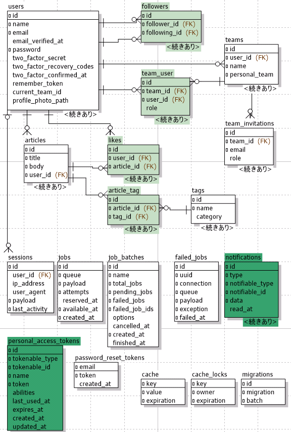
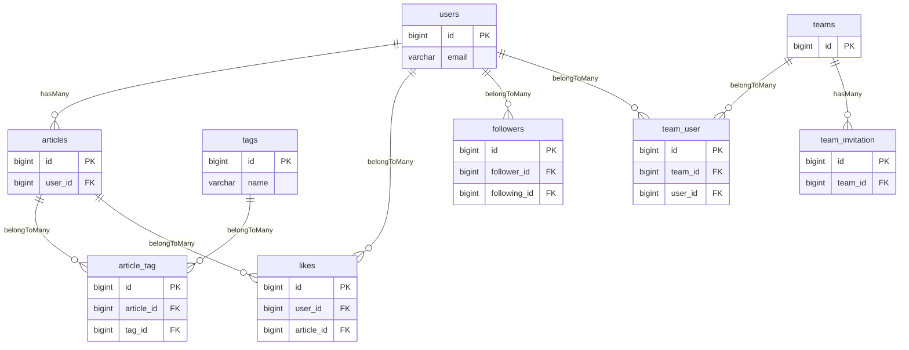

[English](./README.md) | **日本語**

# Laravel + Vue3 + 📊Dimensional chart Dashboard テンプレート

Laravel と Vue で実装された、📊次元チャートを使用したダッシュボード付き管理パネルのテンプレートプロジェクトです。

- [ライブデモ](https://sakanaclub.xsrv.jp/laravel-sports-hp/public/index.php/dashboard-dc-pub?data=covid19-data-2021-02-28)

[](https://sakanaclub.xsrv.jp/laravel-sports-hp/public/index.php/dashboard-dc?data=covid19-data-2021-02-28)

- [Dimensional chart](http://dc-js.github.io/dc.js/) はワンクリックで切り替え・比較ができ、多次元での分析が容易です。
  

## 機能

- [Dimensional chart(dc.js)](http://dc-js.github.io/dc.js/) を使用したダッシュボード
  - [記事ダッシュボード](https://sakanaclub.xsrv.jp/laravel-sports-hp/public/index.php/dashboard-dc-pub?data=test-article-like)
  - [さらに多くの次元チャートを含むダッシュボード](#link-dc-demo)
  - ダッシュボードモード: 📊Chart | GoogleMap | StreetView | YouTube
      <details>
        <summary>詳細を展開</summary>
        <div style="display: flex; gap: 10px; text-align: center;">
          <div>
            <a href="https://sakanaclub.xsrv.jp/laravel-sports-hp/public/index.php/dashboard-dc-pub?data=covid19-data-2021-02-28&layout=default">
              <div>📊Chart モード</div>
              
            </a>
          </div>
          <div>
            <a href="https://sakanaclub.xsrv.jp/laravel-sports-hp/public/index.php/dashboard-dc-pub?data=ja-quake-noto-safety&layout=gmap">
              <div>
                  GoogleMap モード
              </div>
              
            </a>
          </div>
          <div>
            <a href="https://sakanaclub.xsrv.jp/laravel-sports-hp/public/index.php/dashboard-dc-pub?data=ja-quake-noto-safety&layout=sview">
              <div>
                  StreetView モード
              </div>
              
            </a>
          </div>
          <div>
            <a href="https://sakanaclub.xsrv.jp/laravel-sports-hp/public/index.php/dashboard-dc-pub?data=game-fc&layout=tube">
              <div>
                YouTube モード
              </div>
              
            </a>
          </div>
        </div>
      </details>
  - 時間 ▶️再生機能
      <details>
        <summary>詳細を展開</summary>
        <div>
          <div>
            <a href="https://sakanaclub.xsrv.jp/laravel-sports-hp/public/index.php/dashboard-dc-pub?data=resas-tourism-foreigners">
            例: 訪日外国人旅行者数の推移
            </a>
          </div>
          
        </div>
      </details>
- [Laravel Jetstream 機能](https://jetstream.laravel.com/introduction.html)
  - 認証
  - 登録
  - ユーザー管理
  - パスワード更新
  - パスワード確認
  - 二要素認証
  - ブラウザセッション
  - チーム管理
- 記事管理
  - CRUD 操作
  - 記事のいいね/よくないね操作
  - RESTful API
  - [記事のいいねを分析するダッシュボード用データの作成](https://sakanaclub.xsrv.jp/laravel-sports-hp/public/index.php/dashboard-dc?data=test-article-like)
- ユーザー管理
  - ユーザーのフォロー/アンフォロー操作
  - ユーザー行動を分析するダッシュボードデータの作成
- GraphQL

## 技術スタック

- バックエンド
  - [Laravel 12](https://laravel.com/)
    - [Eloquent ORM](https://laravel.com/docs/12.x/eloquent-relationships)
  - [inertiajs](https://inertiajs.com/)
  - RESTful API
  - [GraphQL](https://graphql.org/) with [lighthouse](https://lighthouse-php.com/)
  - [sanctum](https://laravel.com/docs/12.x/sanctum) による認証
  - テスト
    - [pest](https://pestphp.com/)
- フロントエンド
  - [vue 3](https://vuejs.org/)
  - [tailwindcss](https://tailwindcss.com/)
    - ダークモード
  - UI コンポーネント
    - [vuetify](https://vuetifyjs.com/en/)
    - [element-plus](https://element-plus.org/en-US/)
  - [Vue Apollo](https://apollo.vuejs.org/) を使用した [GraphQL](https://graphql.org/)
  - [Google Maps API](https://developers.google.com/maps/documentation/javascript/reference?hl=en)
  - [YouTube API](https://developers.google.com/youtube/v3/docs?hl=en)
  - テスト
    - [vitest](https://vitest.dev/)
    - [playwright](https://playwright.dev/) による e2e テスト
  - [Storybook 9](https://storybook.js.org/)

## DeepWiki 説明

このリポジトリの内容の詳細な説明は、DeepWiki ページで確認できます:

[DeepWiki でこのリポジトリを読む](https://deepwiki.com/yoshinaga-ken/laravel-vue-dashboard-dc)

## データベース

- [mariadb-schema.sql](database/schema/mariadb-schema.sql)
  - [詳細](doc/database/er-mwb.png)
  - 
- [
  GraphQL schema](https://sakanaclub.xsrv.jp/laravel-sports-hp/public/index.php/graphql-playground)



## クイックスタート

```bash [Terminal]
# バックエンド - Web サーバーを起動
php artisan serve

# フロントエンド - ウォッチビルド
pnpm run dev

```

サーバーは <http://127.0.0.1:8000> で実行されます

## セットアップ

```bash
# 設定ファイルのセットアップ:
cp .env.example .env

# Composer 依存関係のインストール
composer install

# NPM 依存関係のインストール
pnpm install

# アプリケーションキーの生成:
php artisan key:generate

# .env ファイルの DB_DATABASE フィールドにデータベースを作成してください。
# .env の DB_PASSWORD を設定してください。

# データベースマイグレーションの実行:
php artisan migrate

# データベースシーダーの実行:
php artisan db:seed
```

## 本番環境

本番環境対応の Vue.js フロントエンドアプリケーションをビルド

```bash
pnpm run build

# 出力ディレクトリ: ./public/build/
```

## テストの実行

```bash
# バックエンドテスト
composer test

# フロントエンド vitest
pnpm test

# フロントエンド e2e テスト
$ cd e2e
e2e$ pnpm test

```

## Storybook

```bash
# Storybook をビルドして起動し、ブラウザでコンポーネントを確認
pnpm storybook

# 本番環境用に Storybook をビルド
pnpm build-storybook
# 出力ディレクトリ: ./storybook-static/

```

Storybook は <http://localhost:6007/> で実行されます [🚀デモ](https://sakanaclub.xsrv.jp/laravel-sports-hp/storybook-static/?path=/docs/configure-your-project--docs)

<a id="link-dc-demo"></a>

## 📊その他の分野の次元チャートデモ

[チャートデータの詳細](./public/data/README.md)

- [能登半島地震による行方不明者リスト @2024/1/1](https://sakanaclub.xsrv.jp/laravel-sports-hp/public/index.php/dashboard-dc-pub?data=ja-quake-noto-safety.csv)
- [東京都知事選挙 候補者別得票数 @2024/7/7](https://sakanaclub.xsrv.jp/laravel-sports-hp/public/index.php/dashboard-dc-pub?data=ja-tokyo-election-gubernatorial-2024.csv)
- [参議院選挙 当選当確一覧 @2025 2022 2019](https://sakanaclub.xsrv.jp/laravel-sports-hp/public/index.php/dashboard-dc-pub?data=ja-election-sangiin-2025)
- [衆議院選挙 当選当確一覧 @2024 2021](https://sakanaclub.xsrv.jp/laravel-sports-hp/public/index.php/dashboard-dc-pub?data=ja-election-shugiin-2024)
- 📺🎮日本のテレビゲーム
  - 据置型ゲーム機
    - [第4世代](https://sakanaclub.xsrv.jp/laravel-sports-hp/public/index.php/dashboard-dc-pub?data=game-gen4.csv)
      - [NES](https://sakanaclub.xsrv.jp/laravel-sports-hp/public/index.php/dashboard-dc-pub?data=game-fc.csv) | [SNES](https://sakanaclub.xsrv.jp/laravel-sports-hp/public/index.php/dashboard-dc-pub?data=game-smc.csv) | [Genesis](https://sakanaclub.xsrv.jp/laravel-sports-hp/public/index.php/dashboard-dc-pub?data=game-smd.csv) | [TurboGrafx-16](https://sakanaclub.xsrv.jp/laravel-sports-hp/public/index.php/dashboard-dc-pub?data=game-pce.csv)
    - [第3～5世代](https://sakanaclub.xsrv.jp/laravel-sports-hp/public/index.php/dashboard-dc-pub?data=game-gen3.csv)
    - 第5世代
      - [NINTENDO64](https://sakanaclub.xsrv.jp/laravel-sports-hp/public/index.php/dashboard-dc-pub?data=game-n64.csv) | [Playstation1](https://sakanaclub.xsrv.jp/laravel-sports-hp/public/index.php/dashboard-dc-pub?data=game-ps1.csv) | [SEGA SATURN](https://sakanaclub.xsrv.jp/laravel-sports-hp/public/index.php/dashboard-dc-pub?data=game-ss) | [NEOGEO](https://sakanaclub.xsrv.jp/laravel-sports-hp/public/index.php/dashboard-dc-pub?data=game-ac.csv&name=SNK&date=1990-01-01+2005-01-01)
    - 第6世代
      - [Game Cube](https://sakanaclub.xsrv.jp/laravel-sports-hp/public/index.php/dashboard-dc-pub?data=game-gc) | Xbox | PlayStation 2 | Dreamcast
    - 第7世代
      - [Wii](https://sakanaclub.xsrv.jp/laravel-sports-hp/public/index.php/dashboard-dc-pub?data=game-wii) | Xbox 360 | PlayStation 3
  - 携帯型ゲーム機
    - [Game Boy](https://sakanaclub.xsrv.jp/laravel-sports-hp/public/index.php/dashboard-dc-pub?data=game-gb.csv) | [Game Boy Advance](https://sakanaclub.xsrv.jp/laravel-sports-hp/public/index.php/dashboard-dc-pub?data=game-gba.csv) | Nintendo DS | PSP | Nintendo Switch
  - [アーケードビデオゲーム 1974～2024](https://sakanaclub.xsrv.jp/laravel-sports-hp/public/index.php/dashboard-dc-pub?data=game-ac.csv)
  - パーソナルコンピュータ
    - [MSX](https://sakanaclub.xsrv.jp/laravel-sports-hp/public/index.php/dashboard-dc-pub?data=game-msx.csv)
- 天気
  - [日本の主要12都市の「🌡️平均気温」の推移 @1986年～（40年間）](https://sakanaclub.xsrv.jp/laravel-sports-hp/public/index.php/dashboard-dc-pub?data=ja-weather-temperature)
  - [日本の主要12都市の「☔降水量」の推移 @1986年～（40年間）](https://sakanaclub.xsrv.jp/laravel-sports-hp/public/index.php/dashboard-dc-pub?data=ja-weather-precipitation.csv)
  - [日本の主要3都市の「🌡️平均気温」の推移 @1872年～（153年間）](https://sakanaclub.xsrv.jp/laravel-sports-hp/public/index.php/dashboard-dc-pub?data=ja-weather-temperature-3)
  - [日本の主要3都市の「☔降水量」の推移 @1872年～（153年間）](https://sakanaclub.xsrv.jp/laravel-sports-hp/public/index.php/dashboard-dc-pub?data=ja-weather-precipitation-3)
- スポーツ
  - [⚾日本の高校野球選手権大会リスト](https://sakanaclub.xsrv.jp/laravel-sports-hp/public/index.php/dashboard-dc-pub?data=sports-hsb.csv)
  - [🏸スポーツサークル参加動向](https://sakanaclub.xsrv.jp/laravel-sports-hp/public/index.php/dashboard-dc-pub?data=checkin-sakana)
- 食べ物
  - [🍜日本のラーメンリスト](https://sakanaclub.xsrv.jp/laravel-sports-hp/public/index.php/dashboard-dc-pub?data=food-ramen.csv)
- 市場分析
  - [🏬スーパーマーケット店舗数](https://sakanaclub.xsrv.jp/laravel-sports-hp/public/index.php/dashboard-dc-pub?data=store-cnt)
  - [📈スーパーマーケット事業動向](https://sakanaclub.xsrv.jp/laravel-sports-hp/public/index.php/dashboard-dc-pub?data=store-di)
- 地域経済分析
  - [🌾「品目別農業産出額」2016～2021年 @日本](https://sakanaclub.xsrv.jp/laravel-sports-hp/public/index.php/dashboard-dc-pub?data=resas-agriculture.csv)
  - [✈️「指定地域別外国人訪問者数」1994～2021年](https://sakanaclub.xsrv.jp/laravel-sports-hp/public/index.php/dashboard-dc-pub?data=resas-tourism-foreigners.csv)
  - [💰「年間商品販売額」1994～2021年 @日本](https://sakanaclub.xsrv.jp/laravel-sports-hp/public/index.php/dashboard-dc-pub?data=resas-product-sales.csv)
  - [🏢「企業数（市区町村・産業分類・産業別）」2009～2016年 @日本](https://sakanaclub.xsrv.jp/laravel-sports-hp/public/index.php/dashboard-dc-pub?data=resas-municipality-company.csv)
  - [👥人口構成 @日本](https://sakanaclub.xsrv.jp/prefecture-population-dc/?data=population.csv)
- サンプルデータチャート
  - 以下のサンプルチャートの詳細については、[こちら](https://github.com/yoshinaga-ken/laravel-vue-dashboard-dc/issues/17) を参照してください。
  - ※すべてのテストデータは、データ分析手法と可視化技術の学習および検証を目的として作成されたサンプルです。
  - 基本テストデータ
    - [🍹飲料評価データ](https://sakanaclub.xsrv.jp/laravel-sports-hp/public/index.php/dashboard-dc-pub?data=test-drink)
    - [🍱昼食購入データ](https://sakanaclub.xsrv.jp/laravel-sports-hp/public/index.php/dashboard-dc-pub?data=test-lunch)
  - 教育分野テストデータ
    - [🎓大学入試データ](https://sakanaclub.xsrv.jp/laravel-sports-hp/public/index.php/dashboard-dc-pub?data=test-university-entrance)
    - [📚学力テストデータ](https://sakanaclub.xsrv.jp/laravel-sports-hp/public/index.php/dashboard-dc-pub?data=test-academic-achievement)
  - 交通・モビリティ分野テストデータ
    - [🚗交通事故データ](https://sakanaclub.xsrv.jp/laravel-sports-hp/public/index.php/dashboard-dc-pub?data=test-traffic-accident)
    - [🚌公共交通機関利用データ](https://sakanaclub.xsrv.jp/laravel-sports-hp/public/index.php/dashboard-dc-pub?data=test-public-transport)
  - 住宅・不動産分野テストデータ
    - [🏠不動産取引データ](https://sakanaclub.xsrv.jp/laravel-sports-hp/public/index.php/dashboard-dc-pub?data=test-real-estate)
    - [🏗️住宅建設統計](https://sakanaclub.xsrv.jp/laravel-sports-hp/public/index.php/dashboard-dc-pub?data=test-housing-construction)
  - 消費者行動分野テストデータ
    - [💰家計調査データ](https://sakanaclub.xsrv.jp/laravel-sports-hp/public/index.php/dashboard-dc-pub?data=test-household-survey)
    - [🛒Eコマースデータ](https://sakanaclub.xsrv.jp/laravel-sports-hp/public/index.php/dashboard-dc-pub?data=test-ecommerce)
  - 環境・エネルギー分野テストデータ
    - [🌱環境調査データ](https://sakanaclub.xsrv.jp/laravel-sports-hp/public/index.php/dashboard-dc-pub?data=test-environment-survey)
  - 労働・雇用分野テストデータ
    - [💼雇用・労働データ](https://sakanaclub.xsrv.jp/laravel-sports-hp/public/index.php/dashboard-dc-pub?data=test-employment-labor)
  - 国際・グローバルデータ分野テストデータ
    - [🌍地球環境・気候変動データ](https://sakanaclub.xsrv.jp/laravel-sports-hp/public/index.php/dashboard-dc-pub?data=test-global-climate-environmental)
    - [🌏グローバル教育・人間開発データ](https://sakanaclub.xsrv.jp/laravel-sports-hp/public/index.php/dashboard-dc-pub?data=test-global-education-human-development)
    - [🏥グローバル健康・医療システムデータ](https://sakanaclub.xsrv.jp/laravel-sports-hp/public/index.php/dashboard-dc-pub?data=test-global-health-medical-systems)
  - その他の分野テストデータ
    - [🚨犯罪統計データ](https://sakanaclub.xsrv.jp/laravel-sports-hp/public/index.php/dashboard-dc-pub?data=test-crime-statistics)
    - [💻インターネット利用データ](https://sakanaclub.xsrv.jp/laravel-sports-hp/public/index.php/dashboard-dc-pub?data=test-internet-usage)
    - [📈投資信託データ](https://sakanaclub.xsrv.jp/laravel-sports-hp/public/index.php/dashboard-dc-pub?data=test-investment-trust)
    - [🏥医療調査データ](https://sakanaclub.xsrv.jp/laravel-sports-hp/public/index.php/dashboard-dc-pub?data=test-medical-survey)
    - [🎬映画興行収入データ](https://sakanaclub.xsrv.jp/laravel-sports-hp/public/index.php/dashboard-dc-pub?data=test-movie-box-office)
    - [🏛️美術館来場者データ](https://sakanaclub.xsrv.jp/laravel-sports-hp/public/index.php/dashboard-dc-pub?data=test-museum-visitor)
    - [📋特許出願データ](https://sakanaclub.xsrv.jp/laravel-sports-hp/public/index.php/dashboard-dc-pub?data=test-patent-application)
    - [🛍️小売調査データ](https://sakanaclub.xsrv.jp/laravel-sports-hp/public/index.php/dashboard-dc-pub?data=test-retail-survey)
    - [🚢国際貿易データ](https://sakanaclub.xsrv.jp/laravel-sports-hp/public/index.php/dashboard-dc-pub?data=test-international-trade)
    - [✈️訪日外国人消費データ](https://sakanaclub.xsrv.jp/laravel-sports-hp/public/index.php/dashboard-dc-pub?data=test-foreign-visitor-consumption)
    - [📄記事の👍いいね数](https://sakanaclub.xsrv.jp/laravel-sports-hp/public/index.php/dashboard-dc-pub?data=test-article-like)

## 関連リポジトリ

- [covid19-dc](https://github.com/yoshinaga-ken/covid19-dc)
- [nuxt-ui-pro-dashboard-dc](https://github.com/yoshinaga-ken/nuxt-ui-pro-dashboard-dc)
