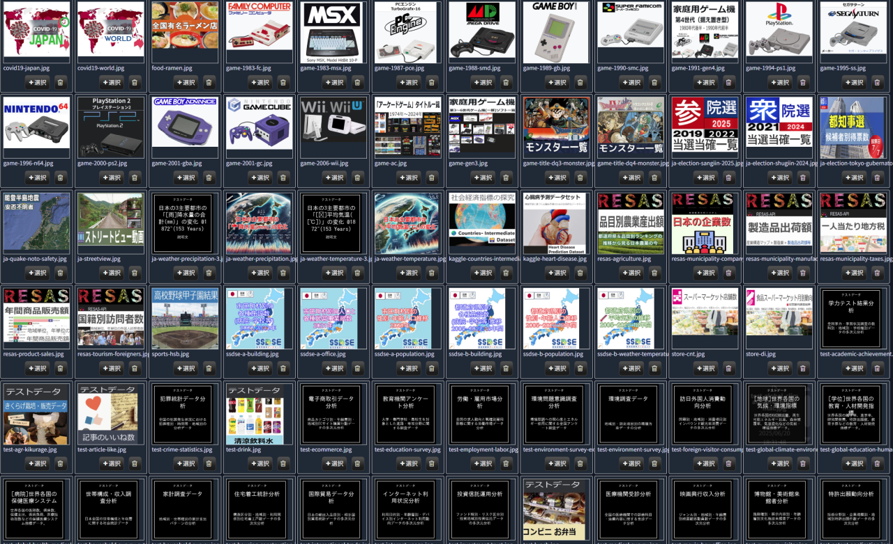
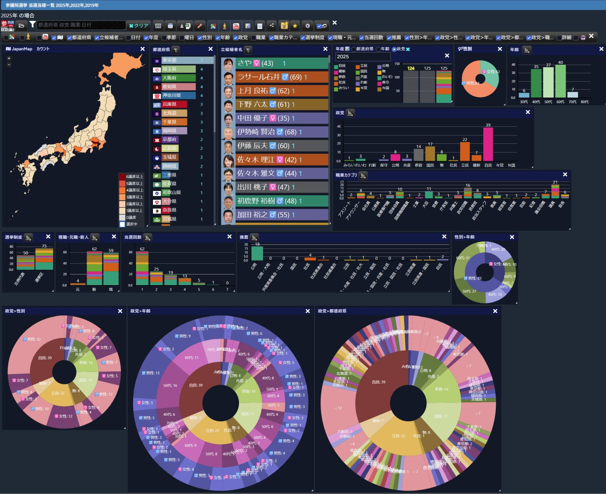
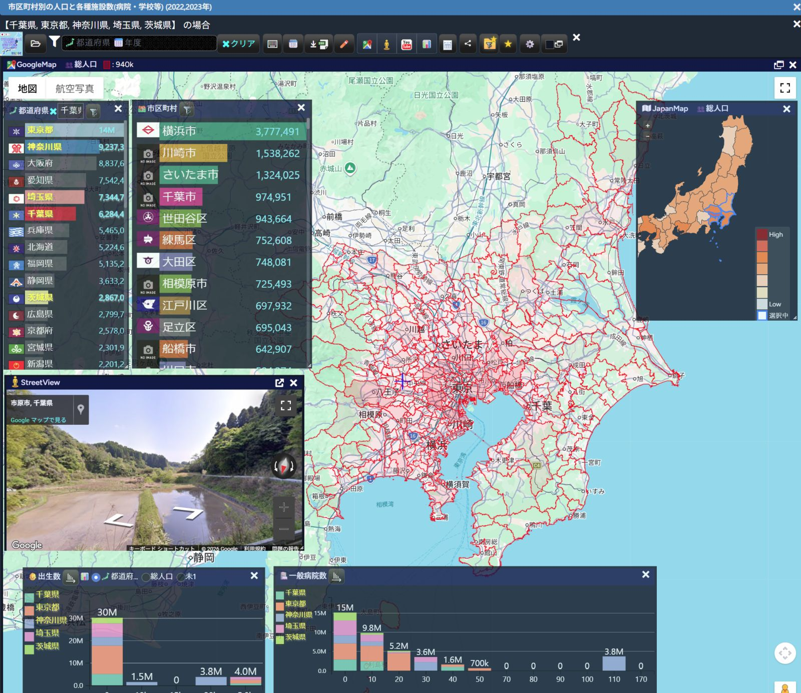
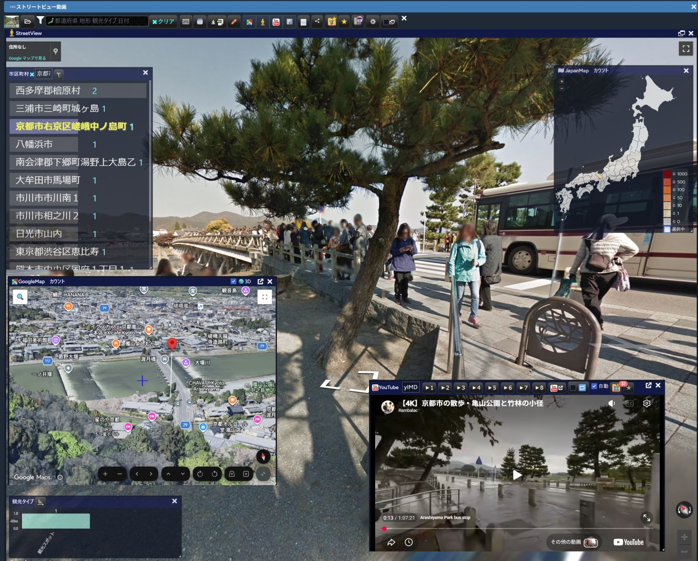
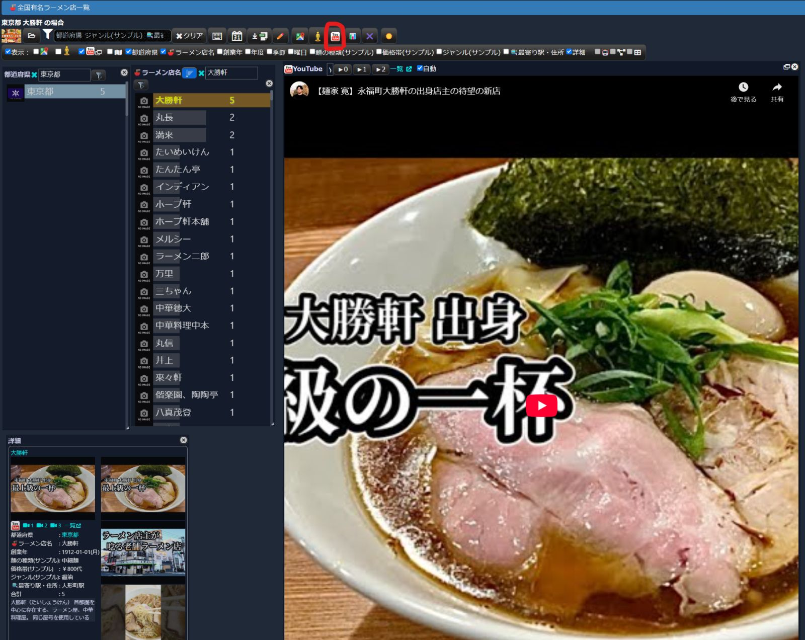
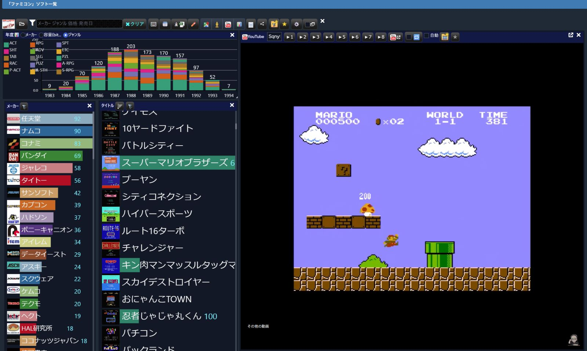
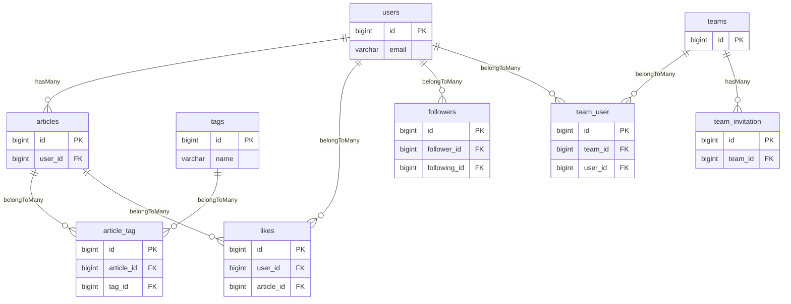

**English** | [日本語](./README.ja.md)

# Laravel + Vue3 + 📊Dimensional chart Dashboard template

A template project for an admin panel with a dashboard using 📊dimensional charts, implemented with laravel and vue.

- [Live demo](https://sakanaclub.xsrv.jp/laravel-sports-hp/public/index.php/dashboard-dc-pub?data=covid19-data-2021-02-28)

[](https://sakanaclub.xsrv.jp/laravel-sports-hp/public/index.php/dashboard-dc?data=covid19-data-2021-02-28)

- [Dimensional chart](http://dc-js.github.io/dc.js/) can be switched and compared with one click, making it easy to analyze in multiple dimensions.
  

## 📊Multidimensional Chart Demo List

[Live demo](https://sakanaclub.xsrv.jp/laravel-sports-hp/public/index.php/dashboard-dc-pub?data=test-drink&fopen)
[](https://sakanaclub.xsrv.jp/laravel-sports-hp/public/index.php/dashboard-dc-pub?data=test-drink&fopen)
[Data details for each chart](./public/data/README.md)

- Infectious Diseases & Public Health
  - [COVID-19 infection status in Japan @2020/4~](https://sakanaclub.xsrv.jp/laravel-sports-hp/public/index.php/dashboard-dc-pub?data=covid19-data-2021-02-28)
  - [COVID-19 infection status in World @2020/4~](https://sakanaclub.xsrv.jp/laravel-sports-hp/public/index.php/dashboard-dc-pub?data=covid19-world)
- [Elections](https://sakanaclub.xsrv.jp/laravel-sports-hp/public/index.php/dashboard-dc-pub?data=ja-election-shugiin-candidates&fopen=1&fopen_filter=ja-election-)
  - [List of confirmed winners of the House of Councillors election @2025 2022 2019](https://sakanaclub.xsrv.jp/laravel-sports-hp/public/index.php/dashboard-dc-pub?data=ja-election-sangiin-2025)
  - [List of winners of the House of Representatives election @2024 2021](https://sakanaclub.xsrv.jp/laravel-sports-hp/public/index.php/dashboard-dc-pub?data=ja-election-shugiin-2024)
  - [Tokyo gubernatorial election votes by candidate @2024/7/7](https://sakanaclub.xsrv.jp/laravel-sports-hp/public/index.php/dashboard-dc-pub?data=ja-election-tokyo-gubernatorial-2024.csv)
- [📺🎮Tv Game in Japan](https://sakanaclub.xsrv.jp/laravel-sports-hp/public/index.php/dashboard-dc-pub?data=game-fc&layout=tube&fopen=1&fopen_filter=game-)
  - home video game consoles
    - [4th generation](https://sakanaclub.xsrv.jp/laravel-sports-hp/public/index.php/dashboard-dc-pub?data=game-gen4.csv&layout=tube)
      - [NES](https://sakanaclub.xsrv.jp/laravel-sports-hp/public/index.php/dashboard-dc-pub?data=game-fc.csv&layout=tube) | [SNES](https://sakanaclub.xsrv.jp/laravel-sports-hp/public/index.php/dashboard-dc-pub?data=game-smc.csv&layout=tube) | [Genesis](https://sakanaclub.xsrv.jp/laravel-sports-hp/public/index.php/dashboard-dc-pub?data=game-smd.csv&layout=tube) | [TurboGrafx-16](https://sakanaclub.xsrv.jp/laravel-sports-hp/public/index.php/dashboard-dc-pub?data=game-pce.csv&layout=tube)
    - [3~5th generation](https://sakanaclub.xsrv.jp/laravel-sports-hp/public/index.php/dashboard-dc-pub?data=game-gen3.csv&layout=tube)
    - 5th generation
      - [NINTENDO64](https://sakanaclub.xsrv.jp/laravel-sports-hp/public/index.php/dashboard-dc-pub?data=game-n64.csv&layout=tube) | [🎮Playstation1](https://sakanaclub.xsrv.jp/laravel-sports-hp/public/index.php/dashboard-dc-pub?data=game-ps1.csv&layout=tube) | [SEGA SATURN](https://sakanaclub.xsrv.jp/laravel-sports-hp/public/index.php/dashboard-dc-pub?data=game-ss&layout=tube) | [NEOGEO](https://sakanaclub.xsrv.jp/laravel-sports-hp/public/index.php/dashboard-dc-pub?data=game-ac.csv&name=SNK&date=1990-01-01+2005-01-01&layout=tube)
    - 6th generation
      - [Game Cube](https://sakanaclub.xsrv.jp/laravel-sports-hp/public/index.php/dashboard-dc-pub?data=game-gc&layout=tube) | [Xbox](https://sakanaclub.xsrv.jp/laravel-sports-hp/public/index.php/dashboard-dc-pub?data=game-xbox&layout=tube) | [🎮PlayStation2](https://sakanaclub.xsrv.jp/laravel-sports-hp/public/index.php/dashboard-dc-pub?data=game-ps2&layout=tube) | [Dreamcast](https://sakanaclub.xsrv.jp/laravel-sports-hp/public/index.php/dashboard-dc-pub?data=game-dreamcast&layout=tube)
    - 7th generation
      - [Wii](https://sakanaclub.xsrv.jp/laravel-sports-hp/public/index.php/dashboard-dc-pub?data=game-wii&layout=tube) | [Xbox 360](https://sakanaclub.xsrv.jp/laravel-sports-hp/public/index.php/dashboard-dc-pub?data=game-xbox360&layout=tube) | [🎮PlayStation3](https://sakanaclub.xsrv.jp/laravel-sports-hp/public/index.php/dashboard-dc-pub?data=game-ps3&layout=tube)
    - 8th generation
      - [🎮PlayStation4](https://sakanaclub.xsrv.jp/laravel-sports-hp/public/index.php/dashboard-dc-pub?data=game-ps4&layout=tube) | [Xbox One](https://sakanaclub.xsrv.jp/laravel-sports-hp/public/index.php/dashboard-dc-pub?data=game-xboxone&layout=tube)
    - 9th generation
      - [Nintendo Switch](https://sakanaclub.xsrv.jp/laravel-sports-hp/public/index.php/dashboard-dc-pub?data=game-switch&layout=tube) | [🎮PlayStation5](https://sakanaclub.xsrv.jp/laravel-sports-hp/public/index.php/dashboard-dc-pub?data=game-ps5&layout=tube) | [Xbox Series X/S](https://sakanaclub.xsrv.jp/laravel-sports-hp/public/index.php/dashboard-dc-pub?data=game-xboxseries&layout=tube)
  - Handheld game consoles
    - 3rd generation
      - [Game Boy](https://sakanaclub.xsrv.jp/laravel-sports-hp/public/index.php/dashboard-dc-pub?data=game-gb.csv&layout=tube)
    - 5th generation
      - [Game Boy Advance](https://sakanaclub.xsrv.jp/laravel-sports-hp/public/index.php/dashboard-dc-pub?data=game-gba.csv&layout=tube)
    - 6th generation
      - [Nintendo DS](https://sakanaclub.xsrv.jp/laravel-sports-hp/public/index.php/dashboard-dc-pub?data=game-ds&layout=tube)
      - [PlayStation Portable](https://sakanaclub.xsrv.jp/laravel-sports-hp/public/index.php/dashboard-dc-pub?data=game-psp&layout=tube)
    - 7th generation
      - [Nintendo 3DS](https://sakanaclub.xsrv.jp/laravel-sports-hp/public/index.php/dashboard-dc-pub?data=game-3ds&layout=tube)
      - [PlayStation Vita](https://sakanaclub.xsrv.jp/laravel-sports-hp/public/index.php/dashboard-dc-pub?data=game-vita&layout=tube)
  - [Arcade Video games 1974～2024](https://sakanaclub.xsrv.jp/laravel-sports-hp/public/index.php/dashboard-dc-pub?data=game-ac.csv&layout=tube)
  - Personal computer
    - [MSX](https://sakanaclub.xsrv.jp/laravel-sports-hp/public/index.php/dashboard-dc-pub?data=game-msx.csv&layout=tube)
  - Game Title
    - [DragonQuest3 Monster List](https://sakanaclub.xsrv.jp/laravel-sports-hp/public/index.php/dashboard-dc-pub?data=game-title-dq3-monster)
    - [DragonQuest4 Monster List](https://sakanaclub.xsrv.jp/laravel-sports-hp/public/index.php/dashboard-dc-pub?data=game-title-dq4-monster)
- Weather
  - [Changes in "🌡️ Average Temperature" in major 12 cities in Japan @1986~(40 Years)](https://sakanaclub.xsrv.jp/laravel-sports-hp/public/index.php/dashboard-dc-pub?data=ja-weather-temperature)
  - [Changes in "☔ Precipitation" in major 12 cities in Japan @1986~(40 Years)](https://sakanaclub.xsrv.jp/laravel-sports-hp/public/index.php/dashboard-dc-pub?data=ja-weather-precipitation.csv)
  - [Changes in "🌡️ Average Temperature" in major 3 cities in Japan @1872~(153 Years)](https://sakanaclub.xsrv.jp/laravel-sports-hp/public/index.php/dashboard-dc-pub?data=ja-weather-temperature-3)
  - [Changes in "☔ Precipitation" in major 3 cities in Japan @1872~(153 Years)](https://sakanaclub.xsrv.jp/laravel-sports-hp/public/index.php/dashboard-dc-pub?data=ja-weather-precipitation-3)
- Sports
  - [⚾List of High School Baseball Championship in Japan](https://sakanaclub.xsrv.jp/laravel-sports-hp/public/index.php/dashboard-dc-pub?data=sports-hsb.csv)
  - [🏸Sports Club Participation Trends](https://sakanaclub.xsrv.jp/laravel-sports-hp/public/index.php/dashboard-dc-pub?data=checkin-sakana)
  - [🏸Sports Club Website Access Trends](https://sakanaclub.xsrv.jp/laravel-sports-hp/public/index.php/dashboard-dc-pub?data=sakana-hp-access)
- Food
  - [🍜List of Ramen in Japan](https://sakanaclub.xsrv.jp/laravel-sports-hp/public/index.php/dashboard-dc-pub?data=food-ramen.csv)
- Movies
  - [🎬Japanese Film List (Box Office + Highly Rated)](https://sakanaclub.xsrv.jp/laravel-sports-hp/public/index.php/dashboard-dc-pub?data=ja-movie-list&layout=tube2)
  - [🎬Studio Ghibli Theatrical Films](https://sakanaclub.xsrv.jp/laravel-sports-hp/public/index.php/dashboard-dc-pub?data=ja-movie-ghibli-films)
- Music
  - [🎵Japanese Hit Song Rankings](https://sakanaclub.xsrv.jp/laravel-sports-hp/public/index.php/dashboard-dc-pub?data=ja-song-hit&layout=tube)
- History & Culture
  - [🏯List of Castles in Japan](https://sakanaclub.xsrv.jp/laravel-sports-hp/public/index.php/dashboard-dc-pub?data=ja-castle&is_gmap_3d=1)
- [Nature & Plants](https://sakanaclub.xsrv.jp/laravel-sports-hp/public/index.php/dashboard-dc-pub?data=inature-timeline&layout=gmap3&fopen&fopen_filter=inature-)
  - [☘️Plant Observation Records](https://sakanaclub.xsrv.jp/laravel-sports-hp/public/index.php/dashboard-dc-pub?data=inature-1-en&layout=gmap3)
  - [☘️Pinus thunbergii Observation Record](https://sakanaclub.xsrv.jp/laravel-sports-hp/public/index.php/dashboard-dc-pub?data=inature-135655-en&layout=gmap)
  - [☘️Acer buergerianum Observation Record](https://sakanaclub.xsrv.jp/laravel-sports-hp/public/index.php/dashboard-dc-pub?data=inature-337792-en&layout=gmap)
  - [☘️Acer palmatum Observation Record](https://sakanaclub.xsrv.jp/laravel-sports-hp/public/index.php/dashboard-dc-pub?data=inature-63512-en&layout=gmap3)
  - [☘️Celastraceae Observation Record](https://sakanaclub.xsrv.jp/laravel-sports-hp/public/index.php/dashboard-dc-pub?data=inature-47539-en&layout=gmap3)
  - [☘️Syringa Observation Record](https://sakanaclub.xsrv.jp/laravel-sports-hp/public/index.php/dashboard-dc-pub?data=inature-47574-en&layout=gmap3)
  - [☘️Rutaceae Observation Record🌎3D](https://sakanaclub.xsrv.jp/laravel-sports-hp/public/index.php/dashboard-dc-pub?data=inature-50623-en&layout=gmap3&is_gmap_3d=1)
  - [☘️Camellia japonica Observation Record🌎3D](https://sakanaclub.xsrv.jp/laravel-sports-hp/public/index.php/dashboard-dc-pub?data=inature-83056-en&layout=gmap3&is_gmap_3d=1&gmap_3d_mode=fca)
  - [☘️Camellia Observation Record🌎3D](https://sakanaclub.xsrv.jp/laravel-sports-hp/public/index.php/dashboard-dc-pub?data=inature-83058-en&layout=gmap3&is_gmap_3d=1&gmap_3d_mode=fca)
  - [🐟Oryzias Observation Record(taxon:90534)](https://sakanaclub.xsrv.jp/laravel-sports-hp/public/index.php/dashboard-dc-pub?data=inature-90534&layout=gmap3)
  - [🪲Dynastinae Observation Record(taxon:324734)](https://sakanaclub.xsrv.jp/laravel-sports-hp/public/index.php/dashboard-dc-pub?data=inature-324734&layout=gmap3)
  - [🦦Lutra Observation Record(taxon:41848)](https://sakanaclub.xsrv.jp/laravel-sports-hp/public/index.php/dashboard-dc-pub?data=inature-41848&layout=gmap3)
  - [🌈Libellulidae Observation Record(taxon:47819)](https://sakanaclub.xsrv.jp/laravel-sports-hp/public/index.php/dashboard-dc-pub?data=inature-47819&layout=gmap3)
  - [🐕Canis familiaris Observation Record(taxon:47144)](https://sakanaclub.xsrv.jp/laravel-sports-hp/public/index.php/dashboard-dc-pub?data=inature-47144&layout=gmap3)
  - [🐈Felis catus Observation Record(taxon:118552)](https://sakanaclub.xsrv.jp/laravel-sports-hp/public/index.php/dashboard-dc-pub?data=inature-118552&layout=gmap3)
- Disasters & Disaster Prevention
  - [List of missing persons due to Noto Peninsula earthquake @2024/1/1](https://sakanaclub.xsrv.jp/laravel-sports-hp/public/index.php/dashboard-dc-pub?data=ja-quake-noto-safety.csv)
- Market Analysis
  - [🏬Number of Supermarket Stores](https://sakanaclub.xsrv.jp/laravel-sports-hp/public/index.php/dashboard-dc-pub?data=store-cnt)
  - [📈Supermarket Business Trends](https://sakanaclub.xsrv.jp/laravel-sports-hp/public/index.php/dashboard-dc-pub?data=store-di)
- Regional Economic Analysis
  - [🌾「Agricultural output by product」2016～2021 @japan](https://sakanaclub.xsrv.jp/laravel-sports-hp/public/index.php/dashboard-dc-pub?data=resas-agriculture.csv)
  - [✈️「Number of visitors by nationality to designated regions」1994～2021](https://sakanaclub.xsrv.jp/laravel-sports-hp/public/index.php/dashboard-dc-pub?data=resas-tourism-foreigners.csv)
  - [💰「Annual product sales」1994～2021 @japan](https://sakanaclub.xsrv.jp/laravel-sports-hp/public/index.php/dashboard-dc-pub?data=resas-product-sales.csv)
  - [🏢「Number of companies (by city, town, village, industry classification, and industry)」2009～2016 @japan](https://sakanaclub.xsrv.jp/laravel-sports-hp/public/index.php/dashboard-dc-pub?data=resas-municipality-company.csv)
  - [👥Gender and Age Population Trends by Prefecture 2005-2022: 18 Years @japan](https://sakanaclub.xsrv.jp/laravel-sports-hp/public/index.php/dashboard-dc-pub?data=ssdse-b-population)
  - [🏥Prefectural Population and Facility (Hospitals, 🏫Schools, etc.) Trends 2005-2022: 18 Years @japan](https://sakanaclub.xsrv.jp/laravel-sports-hp/public/index.php/dashboard-dc-pub?data=ssdse-b-building)
  - [🌡️Prefectural Average Temperature Trends 2005-2022: 18 Years @japan](https://sakanaclub.xsrv.jp/laravel-sports-hp/public/index.php/dashboard-dc-pub?data=ssdse-b-weather-temperature)
  - [👥Age Population Trends by Prefecture 1960-2025: 65 Years @japan](https://sakanaclub.xsrv.jp/prefecture-population-dc/?data=population.csv)
  - [👥Gender and Age Population by City, Ward, Town, and Village 2020 @japan](https://sakanaclub.xsrv.jp/laravel-sports-hp/public/index.php/dashboard-dc-pub?data=ssdse-a-population)
  - [👥Population and Various Numbers by City, Town, and Village 2020 @japan](https://sakanaclub.xsrv.jp/laravel-sports-hp/public/index.php/dashboard-dc-pub?data=ssdse-a-population2) 
  - [🏥Population and Various Facilities (Hospitals, 🏫Schools, etc.) by City, Ward, Town, and Village 2022 @japan](https://sakanaclub.xsrv.jp/laravel-sports-hp/public/index.php/dashboard-dc-pub?data=ssdse-a-building)
  - [🏢Population and Various Private Businesses by City, Ward, Town, and Village 2021 @japan](https://sakanaclub.xsrv.jp/laravel-sports-hp/public/index.php/dashboard-dc-pub?data=ssdse-a-office)
- Samples Data Charts
  - For more information about the sample chart below, please see [here](https://github.com/yoshinaga-ken/laravel-vue-dashboard-dc/issues/17)
  - ※All test data is created as samples for the purpose of learning and verification of data analysis methods and visualization techniques.
  - Basic Test Data
    - [🍹Beverage Rating Data](https://sakanaclub.xsrv.jp/laravel-sports-hp/public/index.php/dashboard-dc-pub?data=test-drink)
    - [🍱Lunch Purchase Data](https://sakanaclub.xsrv.jp/laravel-sports-hp/public/index.php/dashboard-dc-pub?data=test-lunch)
  - Education Field Test Data
    - [🎓University Entrance Exam Data](https://sakanaclub.xsrv.jp/laravel-sports-hp/public/index.php/dashboard-dc-pub?data=test-university-entrance)
    - [📚Academic Achievement Test Data](https://sakanaclub.xsrv.jp/laravel-sports-hp/public/index.php/dashboard-dc-pub?data=test-academic-achievement)
  - Transportation & Mobility Field Test Data
    - [🚗Traffic Accident Data](https://sakanaclub.xsrv.jp/laravel-sports-hp/public/index.php/dashboard-dc-pub?data=test-traffic-accident)
    - [🚌Public Transportation Usage Data](https://sakanaclub.xsrv.jp/laravel-sports-hp/public/index.php/dashboard-dc-pub?data=test-public-transport)
  - Housing & Real Estate Field Test Data
    - [🏠Real Estate Transaction Data](https://sakanaclub.xsrv.jp/laravel-sports-hp/public/index.php/dashboard-dc-pub?data=test-real-estate)
    - [🏗️Housing Construction Statistics](https://sakanaclub.xsrv.jp/laravel-sports-hp/public/index.php/dashboard-dc-pub?data=test-housing-construction)
  - Consumer Behavior Field Test Data
    - [💰Household Survey Data](https://sakanaclub.xsrv.jp/laravel-sports-hp/public/index.php/dashboard-dc-pub?data=test-household-survey)
    - [🛒E-commerce Data](https://sakanaclub.xsrv.jp/laravel-sports-hp/public/index.php/dashboard-dc-pub?data=test-ecommerce)
  - Environment & Energy Field Test Data
    - [🌱Environmental Survey Data](https://sakanaclub.xsrv.jp/laravel-sports-hp/public/index.php/dashboard-dc-pub?data=test-environment-survey)
  - Labor & Employment Field Test Data
    - [💼Employment & Labor Data](https://sakanaclub.xsrv.jp/laravel-sports-hp/public/index.php/dashboard-dc-pub?data=test-employment-labor)
  - International & Global Data Field Test Data
    - [🌍Global Environment & Climate Change Data](https://sakanaclub.xsrv.jp/laravel-sports-hp/public/index.php/dashboard-dc-pub?data=test-global-climate-environmental)
    - [🌏Global Education & Human Development Data](https://sakanaclub.xsrv.jp/laravel-sports-hp/public/index.php/dashboard-dc-pub?data=test-global-education-human-development)
    - [🏥Global Health & Medical Systems Data](https://sakanaclub.xsrv.jp/laravel-sports-hp/public/index.php/dashboard-dc-pub?data=test-global-health-medical-systems)
  - Other Field Test Data
    - [🚨Crime Statistics Data](https://sakanaclub.xsrv.jp/laravel-sports-hp/public/index.php/dashboard-dc-pub?data=test-crime-statistics)
    - [💻Internet Usage Data](https://sakanaclub.xsrv.jp/laravel-sports-hp/public/index.php/dashboard-dc-pub?data=test-internet-usage)
    - [📈Investment Trust Data](https://sakanaclub.xsrv.jp/laravel-sports-hp/public/index.php/dashboard-dc-pub?data=test-investment-trust)
    - [🏥Medical Survey Data](https://sakanaclub.xsrv.jp/laravel-sports-hp/public/index.php/dashboard-dc-pub?data=test-medical-survey)
    - [🎬Movie Box Office Data](https://sakanaclub.xsrv.jp/laravel-sports-hp/public/index.php/dashboard-dc-pub?data=test-movie-box-office)
    - [🏛️Museum Visitor Data](https://sakanaclub.xsrv.jp/laravel-sports-hp/public/index.php/dashboard-dc-pub?data=test-museum-visitor)
    - [📋Patent Application Data](https://sakanaclub.xsrv.jp/laravel-sports-hp/public/index.php/dashboard-dc-pub?data=test-patent-application)
    - [🛍️Retail Survey Data](https://sakanaclub.xsrv.jp/laravel-sports-hp/public/index.php/dashboard-dc-pub?data=test-retail-survey)
    - [🚢International Trade Data](https://sakanaclub.xsrv.jp/laravel-sports-hp/public/index.php/dashboard-dc-pub?data=test-international-trade)
    - [✈️Foreign Visitor Consumption Data](https://sakanaclub.xsrv.jp/laravel-sports-hp/public/index.php/dashboard-dc-pub?data=test-foreign-visitor-consumption)
    - [Number of 👍likes for the 📄article](https://sakanaclub.xsrv.jp/laravel-sports-hp/public/index.php/dashboard-dc-pub?data=test-article-like)

## Features

- Dashboard with [Dimensional chart(dc.js)](http://dc-js.github.io/dc.js/)
  - [Example: Article Dashboard](https://sakanaclub.xsrv.jp/laravel-sports-hp/public/index.php/dashboard-dc-pub?data=test-article-like)
  - Dashboard Mode: 📊Chart | GoogleMap | StreetView | YouTube
    - The screen layout will be adjusted to suit each mode.
      <details open>
        <summary>Expand for details</summary>
        <div style="display: flex; gap: 10px; text-align: center;">
          <div>
              <h3>📊Chart mode</h3>
              <a href="https://sakanaclub.xsrv.jp/laravel-sports-hp/public/index.php/dashboard-dc-pub?data=covid19-data-2021-02-28&layout=default">
                
                🌡️COVID-19 infection status in Japan
              </a>
              <a href="https://sakanaclub.xsrv.jp/laravel-sports-hp/public/index.php/dashboard-dc-pub?data=ja-election-sangiin-2025&layout=default">
                
                List of confirmed winners of the House of Councillors election in Japan
              </a>
          </div>
          <div>
              <h3>
                  GoogleMap mode
              </h3>
              <a href="https://sakanaclub.xsrv.jp/laravel-sports-hp/public/index.php/dashboard-dc-pub?data=ja-quake-noto-safety&layout=gmap">
                
                Noto Peninsula Earthquake in Japan
              </a>
              <a href="https://sakanaclub.xsrv.jp/laravel-sports-hp/public/index.php/dashboard-dc-pub?data=ssdse-a-building&name=%E5%8D%83%E8%91%89%E7%9C%8C+%E6%9D%B1%E4%BA%AC%E9%83%BD+%E7%A5%9E%E5%A5%88%E5%B7%9D%E7%9C%8C+%E5%9F%BC%E7%8E%89%E7%9C%8C+%E8%8C%A8%E5%9F%8E%E7%9C%8C&layout=gmap">
                
                🏥Population and Various Facilities by City, Ward, Town, and Village in japan
              </a>
              <a href="https://sakanaclub.xsrv.jp/laravel-sports-hp/public/index.php/dashboard-dc-pub?data=covid19-data-2021-02-28&is_gmap_3d=1&name=%E5%A4%A7%E9%98%AA%E5%BA%9C">
                
                🌡️COVID-19 Infection Situation in Osaka Prefecture, Japan (🌏3D Mode)
              </a>      
          </div>
          <div>
              <h3>
                  StreetView mode
              </h3>
              <a href="https://sakanaclub.xsrv.jp/laravel-sports-hp/public/index.php/dashboard-dc-pub?data=ja-quake-noto-safety&layout=sview">
                
                Noto Peninsula Earthquake in Japan
              </a>
              <a href="https://sakanaclub.xsrv.jp/laravel-sports-hp/public/index.php/dashboard-dc-pub?data=ja-streetview&name2=%E4%BA%AC%E9%83%BD%E5%B8%82%E5%8F%B3%E4%BA%AC%E5%8C%BA%E5%B5%AF%E5%B3%A8%E4%B8%AD%E3%83%8E%E5%B3%B6%E7%94%BA&layout=sview&is_gmap_3d=1">
                
                🎞️Street View Video
              </a>
          </div>
          <div>
              <h3>
                YouTube mode
              </h3>
              <a href="https://sakanaclub.xsrv.jp/laravel-sports-hp/public/index.php/dashboard-dc-pub?data=food-ramen&layout=tube">
                
                🍜List of Ramen in Japan
              </a>
              <a href="https://sakanaclub.xsrv.jp/laravel-sports-hp/public/index.php/dashboard-dc-pub?data=game-fc&layout=tube">
                
                Nes(Famicom) game List
              </a>
          </div>
        </div>
      </details>
  - Time ▶️Play Function
      <details open>
        <summary>Expand for details</summary>
        <div>
          <div>
            <a href="https://sakanaclub.xsrv.jp/laravel-sports-hp/public/index.php/dashboard-dc-pub?data=resas-tourism-foreigners">
            e.g. Changes in the number of foreign tourists visiting Japan
            </a>
          </div>
          
        </div>
      </details>
- [Laravel Jetstream Features](https://jetstream.laravel.com/introduction.html)
  - Authentication
  - Registration
  - User Management
  - Password Update
  - Password Confirmation
  - Two Factor Authentication
  - Browser Sessions
  - Teams Management
- Articles Management
  - CRUD Operations
  - article like/dislike operations
  - RestFul API
  - Creating data for [a dashboard to analyze article likes](https://sakanaclub.xsrv.jp/laravel-sports-hp/public/index.php/dashboard-dc?data=test-article-like)
- User Management
  - user follow/unfollow operations
  - Creating dashboard data to analyze user behavior
- GraphQL

## Technology Stack

- backend
  - [Laravel 12](https://laravel.com/)
    - [Eloquent ORM](https://laravel.com/docs/12.x/eloquent-relationships)
  - [inertiajs](https://inertiajs.com/)
  - RestFul API
  - [GraphQL](https://graphql.org/) with [lighthouse](https://lighthouse-php.com/)
  - Authentication with [sanctum](https://laravel.com/docs/12.x/sanctum)
  - test
    - [pest](https://pestphp.com/)
- frontend
  - [vue 3](https://vuejs.org/)
  - [tailwindcss](https://tailwindcss.com/)
    - dark mode
  - ui components
    - [vuetify](https://vuetifyjs.com/en/)
    - [element-plus](https://element-plus.org/en-US/)
  - [GraphQL](https://graphql.org/) with [Vue Apollo](https://apollo.vuejs.org/)
  - [Google Maps API](https://developers.google.com/maps/documentation/javascript/reference?hl=en)
  - [YouTube API](https://developers.google.com/youtube/v3/docs?hl=en)
  - test
    - [vitest](https://vitest.dev/)
    - e2e with [playwright](https://playwright.dev/)
  - [Storybook 10](https://storybook.js.org/)

## DeepWiki explanation

A detailed explanation of the contents of this repository can be found on the DeepWiki page:

[Read this repository on DeepWiki](https://deepwiki.com/yoshinaga-ken/laravel-vue-dashboard-dc)

## Database

- [mariadb-schema.sql](database/schema/mariadb-schema.sql)
  - [detail](doc/database/er-mwb.png)
  - 
- [
  GraphQL schema](https://sakanaclub.xsrv.jp/laravel-sports-hp/public/index.php/graphql-playground)


```mermaid
erDiagram
    users ||--o{ articles : hasMany
    articles ||--o{ article_tag : belongToMany
    tags ||--o{ article_tag : belongToMany
    users ||--o{ likes : belongToMany
    articles ||--o{ likes : belongToMany
    users ||--o{ followers : belongToMany
    teams ||--o{ team_user : belongToMany
    users ||--o{ team_user : belongToMany
    teams ||--o{ team_invitation : hasMany

    users {
        bigint id PK
        varchar email
    }
    articles {
        bigint id PK
        bigint user_id FK
    }
    article_tag {
        bigint id PK
        bigint article_id FK
        bigint tag_id FK
    }
    tags {
        bigint id PK
        varchar name
    }
    followers {
        bigint id PK
        bigint follower_id FK
        bigint following_id FK
    }
    likes {
        bigint id PK
        bigint user_id FK
        bigint article_id FK
    }
    team_user {
        bigint id PK
        bigint team_id FK
        bigint user_id FK
    }
    teams {
        bigint id PK
    }
    team_invitation {
        bigint id PK
        bigint team_id FK
    }

```

## Quick Start

```bash [Terminal]
# backend - run web server
php artisan serve

# frontend - watch build
pnpm run dev

```

Server running on <http://127.0.0.1:8000>

## Setup

```bash
# Setup configuration:
cp .env.example .env

# Install Composer dependencies
composer install

# Install NPM dependencies
pnpm install

# Generate application key:
php artisan key:generate

# Create a database in the DB_DATABASE field in the .env file.
# set .env DB_PASSWORD

# Run database migrations:
php artisan migrate

# Run database seeder:
php artisan db:seed
```

## Production

Build a production-ready Vue.js frontend application

```bash
pnpm run build

# output directory: ./public/build/
```

## Running tests

```bash
# Backend test
composer test

# Frontend vitest
pnpm test

# e2e test
$ cd e2e
e2e$ pnpm test

```

## Storybook

```bash
# Build and launch storybook to see the components in the browser
pnpm storybook

# Build storybook for production
pnpm build-storybook
# Output directory: ./storybook-static/

```

Storybook running on <http://localhost:6007/> [🚀demo](https://sakanaclub.xsrv.jp/laravel-sports-hp/storybook-static/?path=/docs/configure-your-project--docs)

## Related Repos

- [covid19-dc](https://github.com/yoshinaga-ken/covid19-dc)
- [nuxt-ui-pro-dashboard-dc](https://github.com/yoshinaga-ken/nuxt-ui-pro-dashboard-dc)
