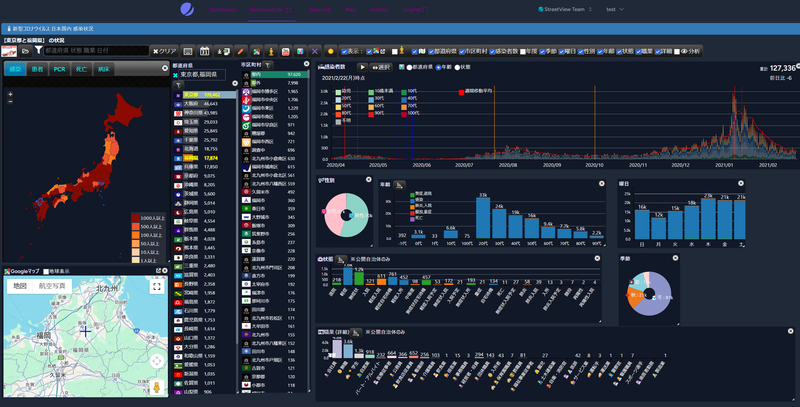
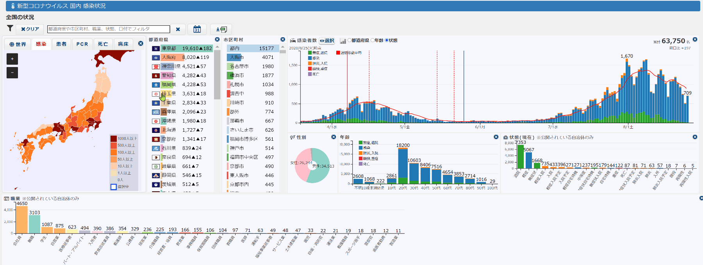
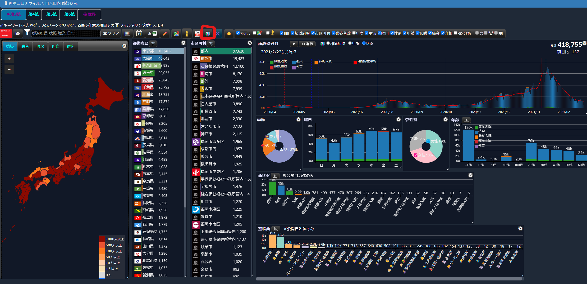
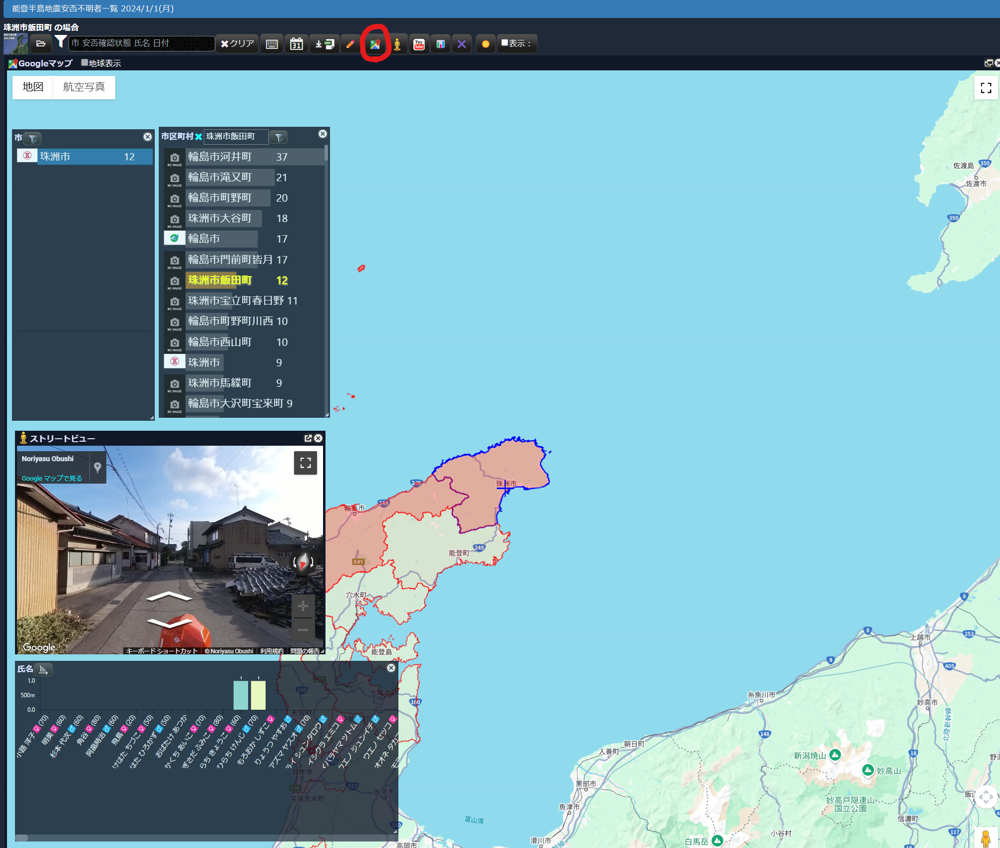
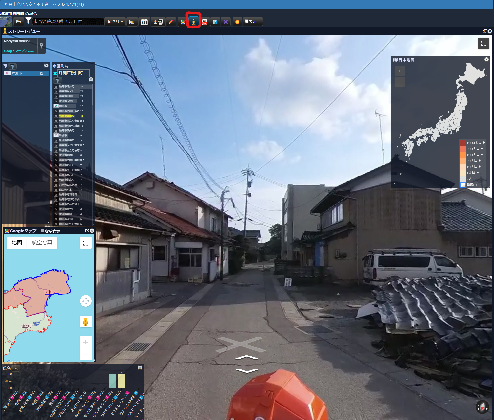
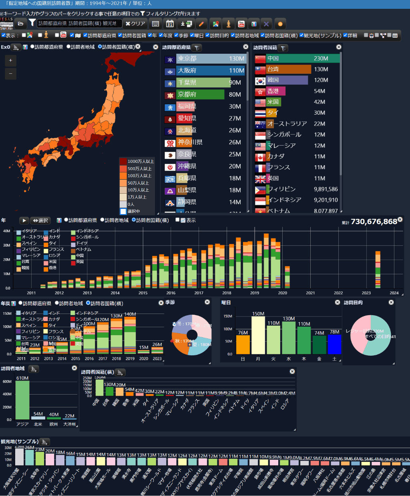
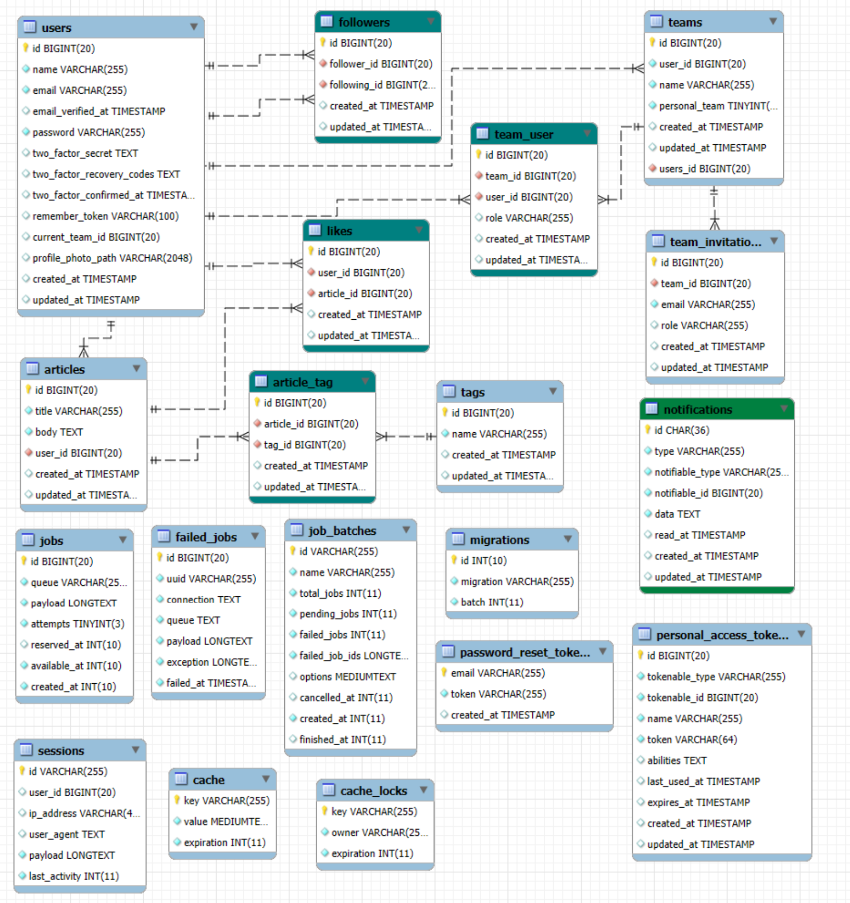
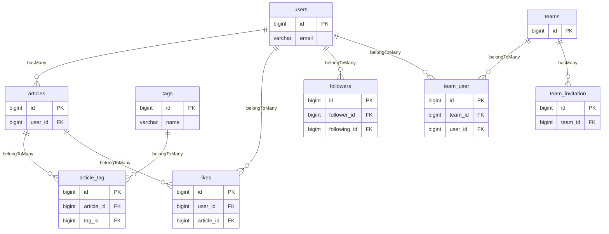

# Laravel + Vue3 + 📊Dimensional chart Dashboard template
A template project for an admin panel with a dashboard using 📊dimensional charts, implemented with laravel and vue.
- [Live demo](https://sakanaclub.xsrv.jp/laravel-sports-hp/public/index.php/dashboard-dc?data=covid19-data-2021-02-28)

[](https://sakanaclub.xsrv.jp/laravel-sports-hp/public/index.php/dashboard-dc?data=covid19-data-2021-02-28)
- [Dimensional chart](http://dc-js.github.io/dc.js/) can be switched and compared with one click, making it easy to analyze in multiple dimensions.



## Features
- Dashboard with [Dimensional chart(dc.js)](http://dc-js.github.io/dc.js/)
  - [Articles Dashboard](https://sakanaclub.xsrv.jp/laravel-sports-hp/public/index.php/dashboard-dc?data=test-article-like)
  - [Dashboard with many more dimensional charts](#link-dc-demo)
  - Dashboard Mode: 📊Chart | GoogleMap | StreetView | YouTube
      <details>
        <summary>Expand for details</summary>
        <div style="display: flex; gap: 10px; text-align: center;">
          <div>
            <a href="https://sakanaclub.xsrv.jp/laravel-sports-hp/public/index.php/dashboard-dc-pub?data=covid19-data-2021-02-28&layout=default">
              <div>📊Chart mode</div>
              
            </a>
          </div>
          <div>
            <a href="https://sakanaclub.xsrv.jp/laravel-sports-hp/public/index.php/dashboard-dc-pub?data=ja-quake-noto-safety&layout=gmap">
              <div>
                  GoogleMap mode
              </div>
              
            </a>
          </div>
          <div>
            <a href="https://sakanaclub.xsrv.jp/laravel-sports-hp/public/index.php/dashboard-dc-pub?data=ja-quake-noto-safety&layout=sview">
              <div>
                  StreetView mode
              </div>
              
            </a>
          </div>
          <div>
            <a href="https://sakanaclub.xsrv.jp/laravel-sports-hp/public/index.php/dashboard-dc-pub?data=game-fc&layout=tube">
              <div>
                YouTube mode
              </div>
              
            </a>
          </div>
        </div>
      </details>
  - Time ▶️Play Function
      <details>
        <summary>Expand for details</summary>
        <div>
          <div>
            <a href="https://sakanaclub.xsrv.jp/laravel-sports-hp/public/index.php/dashboard-dc-pub?data=resas-tourism-foreigners">
            e.g. Changes in the number of foreign tourists visiting Japan
            </a>
          </div>
          
        </div>
      </details>
- [Laravel Jetstream Features](https://jetstream.laravel.com/introduction.html)
  - Authentication
  - Registration
  - User Management
  - Password Update
  - Password Confirmation
  - Two Factor Authentication
  - Browser Sessions
  - Teams Management
- Articles Management 
  - CRUD Operations
  - article like/dislike operations
  - RestFul API
  - Creating data for [a dashboard to analyze article likes](https://sakanaclub.xsrv.jp/laravel-sports-hp/public/index.php/dashboard-dc?data=test-article-like)
- User Management 
  - user follow/unfollow operations
  - Creating dashboard data to analyze user behavior
- GraphQL

## Technology Stack
- backend
  - [Laravel 12](https://laravel.com/) 
    - [Eloquent ORM](https://laravel.com/docs/12.x/eloquent-relationships)
  - [inertiajs](https://inertiajs.com/)
  - RestFul API
  - [GraphQL](https://graphql.org/) with [lighthouse](https://lighthouse-php.com/)
  - Authentication with [sanctum](https://laravel.com/docs/12.x/sanctum)
  - test
    - [pest](https://pestphp.com/)
- frontend
  - [vue 3](https://vuejs.org/)
  - [tailwindcss](https://tailwindcss.com/)
    - dark mode
  - ui components
    - [vuetify](https://vuetifyjs.com/en/)
    - [element-plus](https://element-plus.org/en-US/)
  - [GraphQL](https://graphql.org/) with [Vue Apollo](https://apollo.vuejs.org/)
  - [Google Maps API](https://developers.google.com/maps/documentation/javascript/reference?hl=en)
  - [YouTube API](https://developers.google.com/youtube/v3/docs?hl=en)
  - test 
    - [vitest](https://vitest.dev/)
    - e2e with [playwright](https://playwright.dev/)
  - [Storybook 9](https://storybook.js.org/)

## DeepWiki explanation

A detailed explanation of the contents of this repository can be found on the DeepWiki page:

[Read this repository on DeepWiki](https://deepwiki.com/yoshinaga-ken/laravel-vue-dashboard-dc)

## Database
- [mariadb-schema.sql](database/schema/mariadb-schema.sql)
  
- [
GraphQL schema](https://sakanaclub.xsrv.jp/laravel-sports-hp/public/index.php/graphql-playground)

```mermaid
erDiagram
    users ||--o{ articles : hasMany
    articles ||--o{ article_tag : belongToMany
    tags ||--o{ article_tag : belongToMany
    users ||--o{ likes : belongToMany
    articles ||--o{ likes : belongToMany
    users ||--o{ followers : belongToMany
    teams ||--o{ team_user : belongToMany
    users ||--o{ team_user : belongToMany
    teams ||--o{ team_invitation : hasMany

    users {
        bigint id PK
        varchar email
    }
    articles {
        bigint id PK
        bigint user_id FK
    }
    article_tag {
        bigint id PK
        bigint article_id FK
        bigint tag_id FK
    }
    tags {
        bigint id PK
        varchar name
    }
    followers {
        bigint id PK
        bigint follower_id FK
        bigint following_id FK
    }
    likes {
        bigint id PK
        bigint user_id FK
        bigint article_id FK
    }
    team_user {
        bigint id PK
        bigint team_id FK
        bigint user_id FK
    }
    teams {
        bigint id PK
    }
    team_invitation {
        bigint id PK
        bigint team_id FK
    }

```
 
## Quick Start

```bash [Terminal]
# backend - run web server 
php artisan serve

# frontend - watch build
pnpm run dev

```
Server running on <http://127.0.0.1:8000>

## Setup

```bash
# Setup configuration:
cp .env.example .env

# Generate application key:
php artisan key:generate

# Create a database in the DB_DATABASE field in the .env file.

# Run database migrations:
php artisan migrate

# Run database seeder:
php artisan db:seed

# Install Composer dependencies
composer install

# Install NPM dependencies
pnpm install
```


## Production

Build a production-ready Vue.js frontend application

```bash
pnpm run build

# output directory: ./public/build/
```

## Running tests

```bash
# Backend test
vendor/bin/pest

# Frontend vitest
pnpm test

# Frontend e2e test
$ cd e2e
e2e$ npx playwright test

```

## Storybook
```bash
# Build and launch storybook to see the components in the browser
pnpm storybook

# Build storybook for production
pnpm build-storybook
# Output directory: ./storybook-static/

````
Storybook running on <http://localhost:6007/> [🚀demo](https://sakanaclub.xsrv.jp/laravel-sports-hp/storybook-static/?path=/docs/configure-your-project--docs)

<a id="link-dc-demo"></a>
## 📊Dimensional chart demo for other fields
[Details chart data](./public/data/README.md)
- [List of missing persons due to Noto Peninsula earthquake @2024/1/1](https://sakanaclub.xsrv.jp/laravel-sports-hp/public/index.php/dashboard-dc-pub?data=ja-quake-noto-safety.csv)
- [Tokyo gubernatorial election votes by candidate @2024/7/7](https://sakanaclub.xsrv.jp/laravel-sports-hp/public/index.php/dashboard-dc-pub?data=ja-tokyo-gubernatorial-election.csv)
- 📺🎮Tv Game in Japan
  - home video game consoles 
    - [4th generation](https://sakanaclub.xsrv.jp/laravel-sports-hp/public/index.php/dashboard-dc-pub?data=game-gen4.csv)
      - [NES](https://sakanaclub.xsrv.jp/laravel-sports-hp/public/index.php/dashboard-dc-pub?data=game-fc.csv) | [SNES](https://sakanaclub.xsrv.jp/laravel-sports-hp/public/index.php/dashboard-dc-pub?data=game-smc.csv) | [Genesis](https://sakanaclub.xsrv.jp/laravel-sports-hp/public/index.php/dashboard-dc-pub?data=game-smd.csv) | [TurboGrafx-16](https://sakanaclub.xsrv.jp/laravel-sports-hp/public/index.php/dashboard-dc-pub?data=game-pce.csv)
    - [3~5th generatio](https://sakanaclub.xsrv.jp/laravel-sports-hp/public/index.php/dashboard-dc-pub?data=game-gen3.csv)
    - 5th generation
      - [NINTENDO64](https://sakanaclub.xsrv.jp/laravel-sports-hp/public/index.php/dashboard-dc-pub?data=game-n64.csv) | [Playstation1](https://sakanaclub.xsrv.jp/laravel-sports-hp/public/index.php/dashboard-dc-pub?data=game-ps1.csv) | [SEGA SATURN](https://sakanaclub.xsrv.jp/laravel-sports-hp/public/index.php/dashboard-dc-pub?data=game-ss) | [NEOGEO](https://sakanaclub.xsrv.jp/laravel-sports-hp/public/index.php/dashboard-dc-pub?data=game-ac.csv&name=SNK&date=1990-01-01+2005-01-01)
    - 6th generation
      - [Game Cube](https://sakanaclub.xsrv.jp/laravel-sports-hp/public/index.php/dashboard-dc-pub?data=game-gc) | Xbox | PlayStation 2 | Dreamcast
    - 7th generation
      - [Wii](https://sakanaclub.xsrv.jp/laravel-sports-hp/public/index.php/dashboard-dc-pub?data=game-wii) | Xbox 360 | PlayStation 3
  - Handheld game consoles
    - [Game Boy](https://sakanaclub.xsrv.jp/laravel-sports-hp/public/index.php/dashboard-dc-pub?data=game-gb.csv) | [Game Boy Advance](https://sakanaclub.xsrv.jp/laravel-sports-hp/public/index.php/dashboard-dc-pub?data=game-gba.csv) | Nintendo DS | PSP | Nintendo Switch
  - [Arcade Video games 1974～2024](https://sakanaclub.xsrv.jp/laravel-sports-hp/public/index.php/dashboard-dc-pub?data=game-ac.csv)
  - Personal computer
    - [MSX](https://sakanaclub.xsrv.jp/laravel-sports-hp/public/index.php/dashboard-dc-pub?data=game-msx.csv)
- Weather
  - [Changes in "🌡️ Average Temperature" in major 12 cities in Japan @1986~(40 Years)](https://sakanaclub.xsrv.jp/laravel-sports-hp/public/index.php/dashboard-dc-pub?data=ja-weather-temperature)
  - [Changes in "☔ Precipitation" in major 12 cities in Japan @1986~(40 Years)](https://sakanaclub.xsrv.jp/laravel-sports-hp/public/index.php/dashboard-dc-pub?data=ja-weather-precipitation.csv)
  - [Changes in "🌡️ Average Temperature" in major 3 cities in Japan @1872~(153 Years)](https://sakanaclub.xsrv.jp/laravel-sports-hp/public/index.php/dashboard-dc-pub?data=ja-weather-temperature-3)
  - [Changes in "☔ Precipitation" in major 3 cities in Japan @1872~(153 Years)](https://sakanaclub.xsrv.jp/laravel-sports-hp/public/index.php/dashboard-dc-pub?data=ja-weather-precipitation-3)
- Sports
  - [⚾List of High School Baseball Championship in Japan](https://sakanaclub.xsrv.jp/laravel-sports-hp/public/index.php/dashboard-dc-pub?data=sports-hsb.csv)
  - [🏸Trends in sports circle participation](https://sakanaclub.xsrv.jp/laravel-sports-hp/public/index.php/dashboard-dc-pub?data=checkin-sakana)
- Food
  - [🍜List of Ramen in Japan](https://sakanaclub.xsrv.jp/laravel-sports-hp/public/index.php/dashboard-dc-pub?data=food-ramen.csv)
- Market Analysis
  - [Number of Supermarket Stores](https://sakanaclub.xsrv.jp/laravel-sports-hp/public/index.php/dashboard-dc-pub?data=store-cnt)
  - [Supermarket Business Trends](https://sakanaclub.xsrv.jp/laravel-sports-hp/public/index.php/dashboard-dc-pub?data=store-di)
- Regional Economic Analysis
  - [「Agricultural output by product」2016～2021 @japan](https://sakanaclub.xsrv.jp/laravel-sports-hp/public/index.php/dashboard-dc-pub?data=resas-agriculture.csv)
  - [「Number of visitors by nationality to designated regions」1994～2021](https://sakanaclub.xsrv.jp/laravel-sports-hp/public/index.php/dashboard-dc-pub?data=resas-tourism-foreigners.csv)
  - [「Annual product sales」1994～2021 @japan](https://sakanaclub.xsrv.jp/laravel-sports-hp/public/index.php/dashboard-dc-pub?data=resas-product-sales.csv)
  - [「Number of companies (by city, town, village, industry classification, and industry)」2009～2016 @japan](https://sakanaclub.xsrv.jp/laravel-sports-hp/public/index.php/dashboard-dc-pub?data=resas-municipality-company.csv)
  - [population composition @japan](https://sakanaclub.xsrv.jp/prefecture-population-dc/?data=population.csv)
- Samples
  - [Number of 👍likes for the 📄article](https://sakanaclub.xsrv.jp/laravel-sports-hp/public/index.php/dashboard-dc-pub?data=test-article-like)

## Related Repos
- [covid19-dc](https://github.com/yoshinaga-ken/covid19-dc)
- [nuxt-ui-pro-dashboard-dc](https://github.com/yoshinaga-ken/nuxt-ui-pro-dashboard-dc)
