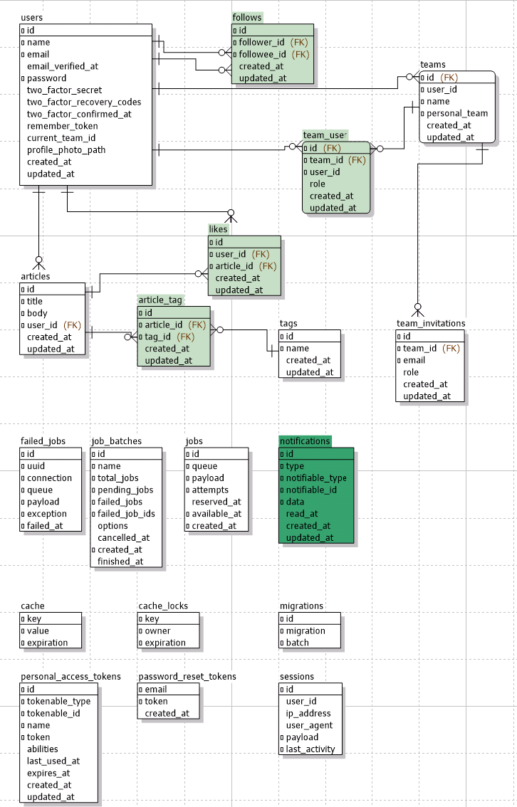

# Laravel + Vue3 + Dimensional chart Dashboard template
- [Live demo](https://sakanaclub.xsrv.jp/laravel-sports-hp/public/index.php/dashboard-dc?data=covid19-data-2021-02-28)


## Features
- Dashboard with [Dimensional chart(dc.js)](http://dc-js.github.io/dc.js/)
  - [Articles Dashboard](https://sakanaclub.xsrv.jp/laravel-sports-hp/public/index.php/dashboard-dc?data=test-article-like)
  - Dashboard with many more dimensional charts
- [Laravel Jetstream Features](https://jetstream.laravel.com/introduction.html)
  - Authentication
  - Registration
  - User Management
  - Password Update
  - Password Confirmation
  - Two Factor Authentication
  - Browser Sessions
  - Teams Management
- articles CRUD
  - article like/dislike
  - API
  - article dashboard data create
- User Management 
  - follow/unfollow
- GraphQL

## Technology Stack
- backend
  - laravel 11
    - Eloquent ORM
  - inertia
  - RestFul API
  - graphql by lighthouse
  - Authentication by sanctum
  - test
    - pest
- frontend
  - vue 3
  - tailwindcss
    - dark mode
  - ui components
    - vuetify
    - element-plus
  - graphql by apollo
  - google map api
  - youtube api
  - test 
    - vitest
    - e2e by playwright

## Database
- [mariadb-schema.sql](database/schema/mariadb-schema.sql)
- 
- 

## Quick Start

```bash [Terminal]
# backend - run web server 
php artisan serve

# frontend - watch build
pnpm run dev

```

## Setup

```bash
# Setup configuration:
cp .env.example .env

# Generate application key:
php artisan key:generate

# Create a database in the DB_DATABASE field in the .env file.

# Run database migrations:
php artisan migrate

# Run database seeder:
php artisan db:seed

# Install Composer dependencies
composer install

# Install NPM dependencies
pnpm install
```


## Production

Build a production-ready Vue.js frontend application

```bash
pnpm run build

# output: public/build/
```

## Running tests

```bash
# Backend test
vendor/bin/pest -p

# Frontend vitest
pnpm test

# Frontend e2e test
$ cd e2e
e2e$ npx playwright test

```
